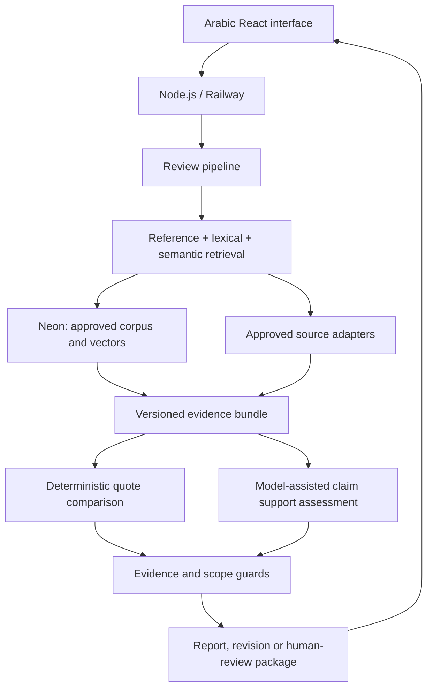

# Basirah | بصيرة

Evidence-linked review of Arabic Islamic content before publication.

A quotation can be accurate while the conclusion drawn from it exceeds the source. Basirah separates **quotation fidelity** from **claim support**, targeting unsupported generalization, omitted qualifications, and unsupported exclusivity.

> **Status: Railway staging prototype, 6 October 2026.** The real guest-analysis/result flow and authenticated reviewer workspace are deployed at [api-staging-42bc.up.railway.app](https://api-staging-42bc.up.railway.app/). Reviewers can edit separate versioned reports and evidence; source publication is a separate explicit operation. Selected Arabic comparisons are verified, but full reviewer/email/RAG acceptance, comprehensive source coverage and scientific evaluation are **not complete**. A successful software check is not proof of religious correctness. See the [current checkpoint and remaining tests](docs/evidence/2026-10-06-reviewer-staging-checkpoint.md).

## Start here

Browse the [documentation hub](docs/README.md) and [English–Arabic terminology guide](docs/product/GLOSSARY.md). Development progress is tracked on the [delivery board](https://github.com/users/smaq777/projects/14).

| Audience           | Read                                                                                                                                                                                                                                                        |
| ------------------ | ----------------------------------------------------------------------------------------------------------------------------------------------------------------------------------------------------------------------------------------------------------- |
| New developer      | [Contributing](CONTRIBUTING.md), [setup](docs/operations/SETUP.md), [current status](docs/STATUS.md)                                                                                                                                                        |
| Committee          | [Judge quickstart](docs/hackathon/JUDGE_QUICKSTART.md), [committee guide](docs/hackathon/COMMITTEE_GUIDE.md), [challenge alignment](docs/hackathon/ALIGNMENT.md), [business model and Arabic review cases](docs/hackathon/BUSINESS_MODEL_AND_TEST_CASES.md) |
| Product and design | [Requirements](docs/product/REQUIREMENTS.md), [user experience](docs/product/UX.md)                                                                                                                                                                         |
| Engineering        | [Complete system blueprint](docs/architecture/SYSTEM_BLUEPRINT.md), [architecture summary](docs/architecture/ARCHITECTURE.md), [RAG](docs/architecture/RAG.md), [data model](docs/architecture/DATA_MODEL.md)                                               |
| Integrations       | [Credential setup](docs/operations/CREDENTIALS.md), [API/source registry](docs/api/PROVIDERS.md), [API contract](docs/api/OPENAPI.yaml)                                                                                                                     |
| Quality            | [Testing](docs/testing/STRATEGY.md), [test cases](docs/testing/CASES.md), [security](SECURITY.md)                                                                                                                                                           |
| Planning           | [Backlog](docs/planning/BACKLOG.md), [GitHub Issues](https://github.com/smaq777/Basira-Hackathon/issues), [team workflow](docs/governance/WORKFLOW.md)                                                                                                      |
| Evidence           | [Provider setup evidence](docs/evidence/2026-10-02-provider-setup.md), [foundation work](docs/evidence/2026-09-30.md), [Dorar assessment](docs/api/DORAR_AUDIT.md)                                                                                          |

## Local development

The default-off [source-review integration](docs/architecture/FOUNDATION_INTEGRATION.md)
adds a persisted report path for configured local development. The separately
configured hosted-demo path is active on Railway staging; model interpretation
remains provisional and evidence-bound. See the
[reviewer staging runbook](docs/operations/REVIEWER_STAGING_WORKFLOW.md).

Use Node.js **24 LTS** and npm **11**. Foundation tests require no external credentials.

```bash
npm ci
npm run check
npm run dev:api
# In another terminal:
npm run dev:web
```

Web: `http://localhost:5173`. API: `http://localhost:3000`. The app provides the Arabic public journey and a Clerk-protected reviewer workspace. Authorization defaults to an explicit reviewer allowlist; hackathon staging temporarily admits any authenticated Clerk user so judges are not blocked. Anonymous users never receive reviewer access. The configured staging workspace loads actual tickets and independent human report versions; illustrative local fixtures are not real review results. Text moves directly into an automatic-analysis transition; there is no manual phrase-classification step. Guest sessions, documents, immutable revisions and idempotent review-run lifecycle records are implemented when a database is configured. When source-backed review is disabled, a real submission is saved and routed to an explicit unavailable result with the human-review ticket option; illustrative findings are not substituted. Hosted model assessment is provisional, not scholarly verification.

```bash
npm run build
npm start
```

The built server serves React and `/api` from one origin. `/health` checks process liveness; `/ready` returns `200` only when the database and required migration are available, and otherwise returns `503`. See [operations](docs/operations/SETUP.md).

## Judge reproduction and API keys

The current foundation requires **no API key** to install, test, build or inspect. Start with the [judge quickstart](docs/hackathon/JUDGE_QUICKSTART.md). The [credential guide](docs/operations/CREDENTIALS.md) lists every planned or delivered service, its official account/key page, exact environment-variable name, safe storage location and current implementation status.

Never commit a real value to `.env.example`. Backend credentials belong in Railway or GitHub environment secrets. Any `VITE_*` value is visible in the browser and therefore must not be a secret. Judges should create credentials only for integrations marked implemented in the final tagged release; planned configuration is not required to reproduce this foundation.

| Service                 | Current need                                                                                                                                    | Official setup                                                                                                                                          |
| ----------------------- | ----------------------------------------------------------------------------------------------------------------------------------------------- | ------------------------------------------------------------------------------------------------------------------------------------------------------- |
| Railway                 | Public staging app and isolated staging PostgreSQL are live; production remains gated                                                           | [Railway](https://railway.com/) and [project-token guidance](https://docs.railway.com/cli#authentication)                                               |
| Clerk                   | Reviewer sign-in is implemented; production defaults to owner-approved user IDs, with an explicit authenticated-user mode for hackathon staging | [Clerk API keys](https://dashboard.clerk.com/last-active?path=api-keys) and [React quickstart](https://clerk.com/docs/react/getting-started/quickstart) |
| Vercel                  | Configuration is checked in; authorize and verify this repository before relying on preview checks                                              | [Vercel GitHub integration](https://vercel.com/docs/git/vercel-for-github) and [account tokens](https://vercel.com/account/tokens)                      |
| Neon                    | Production project/schema exist; production runtime and latest migrations need final verification                                               | [Neon console](https://console.neon.tech/)                                                                                                              |
| Cohere                  | Candidate embeddings; not selected by evaluation                                                                                                | [Cohere API keys](https://dashboard.cohere.com/api-keys)                                                                                                |
| Language-model provider | OpenRouter assessment is configured for staging; prompts, citations and source spans remain validated, and results are provisional              | [Provider registry and configuration](docs/api/PROVIDERS.md)                                                                                            |

Exact variables, scope, storage, rotation and environment separation are in the [credential guide](docs/operations/CREDENTIALS.md).

## Intended architecture

React + TypeScript + Vite; Node.js + Express on Railway; Neon PostgreSQL with pgvector and pg_trgm. Cohere Embed v4 is an **evaluation candidate**, not a proven winner. Drizzle is planned for database implementation. Vercel previews are optional and require a provider-side connection specifically authorized for this repository; `main` remains undeployed.



## Scope

- Short Arabic posts and a bounded, approved reference set of 30–50 passages.
- Claim confirmation, quote/source comparison, three reasoning-error categories, evidence-linked findings, editing and rechecking, export and human-review package.
- No independent personal fatwa (فتوى شخصية), no judgments about people, no automatic publication approval.
- General user accounts, images/OCR and unrestricted discussion are later features. The reviewer workspace uses real staging tickets and separately versioned human reports behind Clerk sign-in. Its default authorization is a server-side reviewer allowlist; the temporary hackathon staging mode admits any authenticated user. Full live publication, email and subsequent retrieval acceptance remain pending.
- Provider failure is not a false-claim verdict; lack of evidence is not proof of falsity.

## Challenge and disclosure

Track 4: **Knowledge and verification tools empowering those introducing Islam** — أدوات المعرفة والتحقق لتمكين المعرّفين بالإسلام.

The supplied participant guide sets delivery from **4 October 2026, 09:00 to 6 October 2026, 23:59, Asia/Riyadh**. Preparatory work before 4 October is explicitly disclosed. Reconfirm organizer announcements before submission.

This repository is **private at the owner's request**. It must become public before committee handoff, following an owner-approved secrets, history and rights review. Never upload beneficiary data or credentials.

## Collaboration and licensing

Issue → branch from `development` as `saleh/<issue>-<slug>` → pull request to `development` → staging → human acceptance → `development` to `main` release pull request → manual production gate. GitHub merge commits preserve branch history; squash and rebase merges are disabled. Branch protection remains unverified while GitHub denies protection for this private repository, so written policy and CI are not represented as technical enforcement. See [Contributing](CONTRIBUTING.md).

Project-authored software is [MIT-licensed](LICENSE). Third-party reference texts, datasets and challenge documents retain their own rights; see [rights and attribution](docs/governance/RIGHTS.md). Documentation is English-first; Arabic remains the product language and the language of Islamic examples and terminology.
