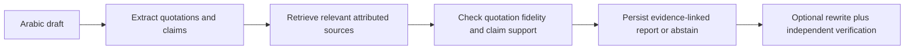

# Basirah | بصيرة

Evidence-linked review of Arabic Islamic content before publication.

An accurate quotation can still accompany an unsupported conclusion. Basirah compares **what the author wrote**, **what the source actually says**, and **whether the inference stays within that evidence**. It is an editorial aid—not a personal fatwa service or automatic scholarly approval.

## Try Basirah

- **Working product:** [Railway API staging](https://api-staging-42bc.up.railway.app/).
- **Public code:** [smaq777/Basira-Hackathon](https://github.com/smaq777/Basira-Hackathon), default branch `development`.

Railway staging is our only submission/demo URL. Guest analysis needs no account, API key or local MCP setup.

Selected fresh Quran/Tafsir comparisons, abstention cases and a useful independently verified rewrite have passed on staging. [Live release evidence](https://github.com/smaq777/Basira-Hackathon/issues/169#issuecomment-6022396451) and [six-case acceptance](docs/evidence/2026-10-06-staging-1.14-acceptance.md) record the tested versions and limits; they are not a general accuracy or uptime guarantee.

### A quick test for judges

Paste this public rough draft:

> قال تعالى: «وإن تخفوها وتؤتوها الفقراء فهو خير لكم» [البقرة: 271]. لما نخفي الصدقة ونعطيها للفقراء فهذا خير للمتصدق.

1. Start analysis. Compare the quotation and author claim with the attributed Quran/Tafsir evidence.
2. Inspect the condition of giving to the poor, source references and explanation of support.
3. At the end, request improved author wording. Copy is enabled only after independent preservation checks; numbered References identify the evidence actually used. Cancellation leaves the original unchanged.

Wording may vary, but the quotation, condition and meaning must remain intact. An unstated comparison such as «من إظهارها» must not be added. If no safe evidence-backed improvement exists, Basirah withholds it and offers human review.

See the [judge quickstart](docs/hackathon/JUDGE_QUICKSTART.md) for contradictory and insufficient-context cases. Create a fresh review in your own browser: report links are session-owned, not public share links.

## How it works



React/TypeScript/Vite and the Node.js/Express API share one Railway origin. A leased worker processes immutable revisions. Railway PostgreSQL stores sessions/reports; a separate Neon database supplies exact, lexical and vector retrieval.

AI assists extraction, relevance, assessment and rewriting. Deterministic span, citation, source-binding and preservation checks surround it. Retrieved candidates are not automatically evidence; models cannot invent references or approve themselves.

### Sources and services

| Integration                                                                                          | Role                                                                               |
| ---------------------------------------------------------------------------------------------------- | ---------------------------------------------------------------------------------- |
| [Tafsir MCP](https://tafsirmcp.netlify.app/), [upstream](https://github.com/tafsircenter/tafsir-mcp) | Public, keyless MCP for Quran search and attributed Moyassar/Saadi context         |
| [Quran.com](https://quran.com/), [API documentation](https://api-docs.quran.foundation/)             | Canonical Uthmani Quran text; current public v4 adapter is keyless                 |
| [OpenRouter](https://openrouter.ai/) / [Gemini](https://ai.google.dev/)                              | Primary model gateway; availability-only text backup that cannot bypass validation |
| [Neon](https://neon.com/) / [Railway](https://railway.com/)                                          | Research retrieval / single-origin hosting and report storage                      |
| [Clerk](https://clerk.com/) / [Brevo](https://www.brevo.com/)                                        | Reviewer sign-in / consented transactional notifications                           |
| [Firecrawl](https://www.firecrawl.dev/) / [TinyFish](https://www.tinyfish.ai/)                       | Optional policy-filtered discovery adapters, not automatically approved evidence   |

MCP is a tool protocol, not a scholarly authority. The [source registry](docs/api/PROVIDERS.md) explains actual endpoints, optional/unavailable sources and rights boundaries. The [credential guide](docs/operations/CREDENTIALS.md) gives official key-creation pages, configuration steps and safe storage for every implemented service. Judges do not need these keys to use staging.

## Reproduce locally

Use Node **24 LTS**, npm **11** and the lockfile:

```bash
git clone https://github.com/smaq777/Basira-Hackathon.git
cd Basira-Hackathon
git switch development
npm ci
npm run check
npm run dev:api
# Second terminal:
npm run dev:web
```

Web: `http://localhost:5173`; API: `http://localhost:3000`. Default tests need no paid keys. Live source-backed operation requires the [configured setup](docs/operations/SETUP.md); without it, unavailable operations are disclosed rather than replaced with sample findings. `npm run build` and `npm start` serve the built app from one origin.

## Scope and honest limits

- Input is bounded to 3000 characters. The research snapshot has **175 passages**, 1536-dimensional embeddings and semantic prompt/pipeline **1.14**; it is not comprehensive coverage or qualified source approval.
- Quotation accuracy, inference support and hadith authenticity are different. Ambiguous references and unrelated evidence must not become invented answers.
- Provider failures remain failures; legitimate insufficient context produces abstention/referral. `verification:false` denotes provisional assessment.
- Guest retention is configured to 24 hours after last successful save. Keep the same valid browser session; reads do not renew expiry.
- Reviewer reports and consented ticket emails are implemented. A synthetic lifecycle test confirmed delivery of receipt, progress, published review, closure and reopening messages; [delivery evidence](https://github.com/smaq777/Basira-Hackathon/issues/202#issuecomment-6024644194). Source approval → future retrieval remains a separate acceptance boundary.
- Qualified scholarly evaluation, complete source/asset permissions and measured beneficiary impact remain outstanding.

## Submission and documentation

Basirah targets Track 4: knowledge and verification tools empowering those introducing Islam. The [official challenge](https://islamicaich.org/) lists **6 October 2026, 23:59 Riyadh** as the deadline. Required delivery includes a working demo, permitted public code, operating/source/license records, presentation and video **no longer than two minutes**, submitted through the portal with confirmation retained.

[Submission readiness](docs/hackathon/SUBMISSION_READINESS.md) maps official requirements to evidence and remaining actions. AI assistance is disclosed. No final portal submission or broad scholarly acceptance is claimed.

### Development timeline

- **Before 4 October:** preparatory setup, architecture, documentation, GitHub issues and an early prototype baseline.
- **4–6 October:** intensive implementation and integration of the application, AI/source retrieval, reviewer workflow, notifications, testing and staging deployment.

The [brief development record](docs/hackathon/DEVELOPMENT_TIMELINE.md) identifies the preserved starting version. Importing the repository on 4 October did not make earlier work new hackathon work.

For deeper review: [implemented architecture](docs/architecture/ARCHITECTURE.md) · [component/rights ledger](docs/governance/SUBMISSION_COMPONENTS.md) · [documentation hub](docs/README.md).

Project-authored software is [MIT-licensed](LICENSE); third-party text, models, fonts and assets retain independent rights. Use public/synthetic inputs for demonstrations, never real beneficiary conversations or secrets. Contributions follow [issue → reviewed branch → merge commit](CONTRIBUTING.md); production promotion is deferred.
