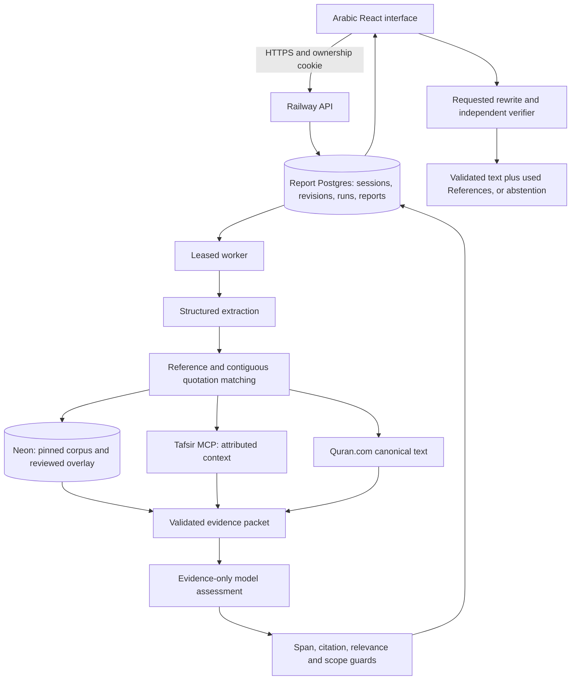

# Basirah | بصيرة

Evidence-linked review of Arabic Islamic content before publication.

A quotation may be accurate while the conclusion drawn from it exceeds its source. Basirah separates **quotation fidelity** (مطابقة النقل) from **support for the author's inference** (كفاية الاستدلال). It is an editorial review tool, not a general chatbot, personal fatwa service or automatic scholarly approval.

## Try the application

| Resource                               | URL / instructions                                                                                                                        |
| -------------------------------------- | ----------------------------------------------------------------------------------------------------------------------------------------- |
| Live staging                           | [Open Basirah](https://api-staging-42bc.up.railway.app/) — paste Arabic text as a guest; no API key required                              |
| Public repository                      | [smaq777/Basira-Hackathon](https://github.com/smaq777/Basira-Hackathon) — default branch `development`                                    |
| Judge reproduction                     | [Arabic examples and expected boundaries](docs/hackathon/JUDGE_QUICKSTART.md)                                                             |
| Submission readiness and Ahmed handoff | [Requirements, evidence and remaining work](docs/hackathon/SUBMISSION_HANDOFF.md)                                                         |
| Engineering                            | [Documentation hub](docs/README.md), [implemented architecture](docs/architecture/ARCHITECTURE.md), [API contract](docs/api/OPENAPI.yaml) |

**Verified checkpoint, 6 October 2026:** application source `51654b2e045a03b33b0809cadf6a316864512a04`, following [PR #195](https://github.com/smaq777/Basira-Hackathon/pull/195). Useful author rewriting, numbered References and exact website copying passed on a fresh public/synthetic example. See the [live receipt](https://github.com/smaq777/Basira-Hackathon/issues/169#issuecomment-6022396451) and [software CI](https://github.com/smaq777/Basira-Hackathon/actions/runs/37506934672). Dated evidence is not an uptime guarantee or general scholarly accuracy claim. Later documentation-only merges may have a newer SHA; [issue #169](https://github.com/smaq777/Basira-Hackathon/issues/169) identifies the latest verified deployment.

### Judge walkthrough

1. Open staging in your own browser profile. Paste the public rough draft below and start analysis.
2. Compare the quotation with its attributed Quran passage. Inspect the author's claim separately, including the condition of giving to the poor.
3. Open sources/context to see actual evidence and its limits.
4. At the end, generate an author-wording improvement. Copy is available only after independent verification; numbered References include only used evidence. Cancel another candidate and confirm the original remains unchanged.
5. Try a contradictory or irrelevant case from the quickstart. Insufficient evidence should produce abstention/referral, not unrelated sources. An upstream outage is an operational failure, not an accepted empty result.

> قال تعالى: «وإن تخفوها وتؤتوها الفقراء فهو خير لكم» [البقرة: 271]. لما نخفي الصدقة ونعطيها للفقراء فهذا خير للمتصدق.

Wording may vary. It must not add an unstated comparison such as «من إظهارها», change the quotation, remove the poor-recipient condition or expand the claim's scope. Rejected candidates are not copyable.

Guest reports are ownership-bound: retain the same browser profile and valid guest session. A copied `reviewId` URL is **not** a public share link. Guest retention is configured to 24 hours after the last successful save; reading does not renew it. Reviewer access requires Clerk sign-in. Hackathon staging temporarily allows authenticated judges into that workspace; this neither verifies scholarly qualifications nor defines production authorization. Use synthetic drafts and only your own consenting test contact details.

## Implemented behavior and limits

- Arabic RTL paste → automatic extraction → retrieval → quotation comparison → evidence-bounded claim assessment → persisted report/reload.
- Deterministic source/span/citation checks surround model-assisted extraction and interpretation. Exact wording is preferred; close candidates are not automatically proof of quotation fidelity or hadith authenticity.
- Canonical Quran and live Moyassar/Saadi context; a pinned **175-passage research snapshot** with 1536-dimensional vectors, plus a separate approved-review contribution overlay. Membership is not scholarly/source-rights approval.
- Provisional support, contradiction and insufficient-context outcomes. Semantic prompt/pipeline **1.14**; six fresh negation/condition/wedding/off-topic cases have [dated acceptance evidence](docs/evidence/2026-10-06-staging-1.14-acceptance.md).
- Evidence-grounded author rewriting, independent verification, cancellation, exact validated copying and numbered used-source References. Candidates are temporary, not durable reports.
- Authenticated report editing/history, tickets, explicit source-publication gate and email outbox/receipt tracking. **Full expert publication → future-user retrieval → consented notification acceptance still needs a final end-to-end receipt.**

Limits: 3000-character input; bounded coverage; ambiguous references remain unresolved; Dorar access is unavailable; provider budgets/upstream availability can interrupt processing. Qualified scholarly evaluation, source rights/approval and measured beneficiary impact are incomplete. `verification:false` deliberately labels provisional review, not an outage by itself. Read [rights](docs/governance/RIGHTS.md), [status](docs/STATUS.md) and [remaining work](docs/hackathon/SUBMISSION_HANDOFF.md).

## How it works

React/TypeScript/Vite and Node.js/Express share one Railway origin. A leased worker processes persisted revisions. Railway report PostgreSQL and Neon research retrieval use separate connections/roles.



Retrieval finds candidates; validation decides what can be shown. Models cannot invent references or approve themselves. OpenRouter is primary; direct Gemini is an availability-only text backup, not a way around failed meaning checks. Rewriting preserves protected quotations and independently checks scope, modality and conditions. [Implemented architecture](docs/architecture/ARCHITECTURE.md) details call order, physical tables, source anchors and failure paths.

## MCPs, APIs and services

MCP means **Model Context Protocol**, a standardized tool interface—not a model, database or scholarly authorization. Tafsir MCP is the application's religious-content MCP. Other services below use REST/SQL/infrastructure; developer MCP tooling is not another runtime evidence source.

| Official service / website                                                                           | Actual role                                                                               | Credential / activation                                                                             |
| ---------------------------------------------------------------------------------------------------- | ----------------------------------------------------------------------------------------- | --------------------------------------------------------------------------------------------------- |
| [Tafsir MCP](https://tafsirmcp.netlify.app/), [upstream](https://github.com/tafsircenter/tafsir-mcp) | Attributed Quran search and Moyassar/Saadi context, checked tool schemas                  | Current public `https://mcp.tafsir.net/mcp` endpoint is keyless                                     |
| [Quran.com](https://quran.com/), [Quran Foundation docs](https://api-docs.quran.foundation/)         | Canonical Uthmani text through existing public v4 adapter                                 | Current adapter keyless; newer Foundation OAuth API is a separate unimplemented migration           |
| [OpenRouter](https://openrouter.ai/), [docs](https://openrouter.ai/docs)                             | Primary extraction/assessment/rewrite; query embeddings                                   | `OPENROUTER_API_KEY`; assessor default `openai/gpt-6.1-sol`; `openai/text-embedding-3-small` / 1536 |
| [Google Gemini](https://ai.google.dev/), [AI Studio](https://aistudio.google.com/)                   | Direct `gemini-2.5-flash` backup for eligible availability failures only                  | `GEMINI_API_KEY`, optional `GEMINI_API_KEY_2`, explicit flag; no embedding substitution             |
| [Neon](https://neon.com/), [console](https://console.neon.tech/)                                     | Research corpus and exact/lexical/vector retrieval; separate approved-contribution writer | Private SQL URLs, verified TLS; management API/MCP is optional developer tooling                    |
| [Railway](https://railway.com/), [docs](https://docs.railway.com/)                                   | Single-origin staging and report PostgreSQL                                               | Owner/operator login or scoped deployment token; judges need neither                                |
| [Clerk](https://clerk.com/), [dashboard](https://dashboard.clerk.com/)                               | Reviewer authentication followed by server authorization                                  | Public publishable key + private secret; not required for guest analysis                            |
| [Brevo](https://www.brevo.com/), [API docs](https://developers.brevo.com/)                           | Consented transactional notifications and delivery-event receipts                         | Private API key + verified sender; queued/accepted/delivered are separate                           |
| [Firecrawl](https://www.firecrawl.dev/), [docs](https://docs.firecrawl.dev/)                         | Optional policy-filtered source discovery, not automatic approved evidence                | `FIRECRAWL_API_KEY`; explicit configuration                                                         |
| [TinyFish](https://www.tinyfish.ai/), [docs](https://docs.tinyfish.ai/)                              | Optional alternate search/fetch adapter                                                   | `TINYFISH_API_KEY`; selected adapter and source policy required                                     |

**Submission URL policy:** Railway API staging is the only product/demo URL. Do not offer or submit a Vercel URL.

The [credential guide](docs/operations/CREDENTIALS.md) gives official pages and detailed setup. The [source registry](docs/api/PROVIDERS.md) separates unavailable/discovery-only Dorar, Quranpedia, Islamic Content, Dawah Center and Shamela. Cohere/Drizzle are historical candidates, not active dependencies of this embedding/storage path. Do not create accounts just because a legacy variable remains in `.env.example`.

## Reproduce locally

Use Node **24 LTS**, npm **11** and the lockfile. Default tests require no paid provider keys. See [setup](docs/operations/SETUP.md) and [testing](docs/testing/STRATEGY.md) for the Python pipeline suite and configured integrations.

```bash
git clone https://github.com/smaq777/Basira-Hackathon.git
cd Basira-Hackathon
git switch development
npm ci
npm run check
npm run dev:api
# In a second terminal, from the repository:
npm run dev:web
```

Web: `http://localhost:5173`; API: `http://localhost:3000`. Without report storage/providers, local operation must disclose unavailability. Offline tests do not reproduce live source-backed analysis. Follow the [integration runbook](docs/architecture/FOUNDATION_INTEGRATION.md); never borrow credentials or accidentally migrate shared staging.

```bash
npm run build
npm start
```

The built server serves web and API from one origin. `/health` checks liveness; `/ready` checks report database/migrations, not all upstreams; `/api/v1/capabilities` discloses enabled paths. Authorized operators can run `node scripts/acceptance-submission-staging.mjs --live`, retaining first outcomes. This is separate from default credential-free tests.

## Competition requirements and disclosure

Track 4: **Knowledge and verification tools empowering those introducing Islam** — أدوات المعرفة والتحقق لتمكين المعرّفين بالإسلام. Confirm the registered track in the portal; this repository is not a registration receipt.

The [official website](https://islamicaich.org/) and [terms](https://islamicaich.org/terms), checked 6 October, require an operational demo, permitted public source, operating/source/tool/license documentation, presentation and a video **no longer than two minutes**. The website states the deadline is **6 October 2026, 23:59 Riyadh (UTC+3)**. Submit through the organizer portal and retain its receipt; email is not a normal substitute. Follow the supplied participant guide and current organizer announcements too.

Pre-4 October preparation is disclosed in the [30 September record](docs/evidence/2026-09-30.md). This repository's initial commit was imported on **4 October at 10:09 Riyadh**; it alone does **not** prove a pre-4 October baseline. The owner must supply original dated baseline/rights evidence and distinguish October 4–6 additions. AI-assisted development/documentation is disclosed, not represented as entirely unaided human work.

The [submission handoff](docs/hackathon/SUBMISSION_HANDOFF.md) maps requirements to evidence or owner actions. Selected tests do not certify full eligibility, general accuracy or a competition outcome. Use public/synthetic or irreversibly anonymized inputs only; never upload real beneficiary conversations, contact records, secrets or unlicensed archives to GitHub, video or model services.

## Collaboration, security and licensing

Issue → short-lived `codex/`, `saleh/` or `ahmed/` branch → review → merge commit into `development` → scoped staging verification. `main` is production-only; promotion is deferred. On 6 October, GitHub read-back confirmed `main` requires one approval and `quality`, `policy`, `dependency-audit`, with force pushes/deletions disabled. Administrators are not enforced by that rule; do not describe it as absolute protection. See [Contributing](CONTRIBUTING.md) and [Security](SECURITY.md).

Project-authored software is [MIT-licensed](LICENSE). Third-party editions, API payloads, models, fonts, marks and challenge materials retain independent rights; see [rights/attribution](docs/governance/RIGHTS.md). Public reachability is not redistribution permission. Keep private credentials in owning platforms/ignored environment files; all `VITE_*` values are browser-visible.
