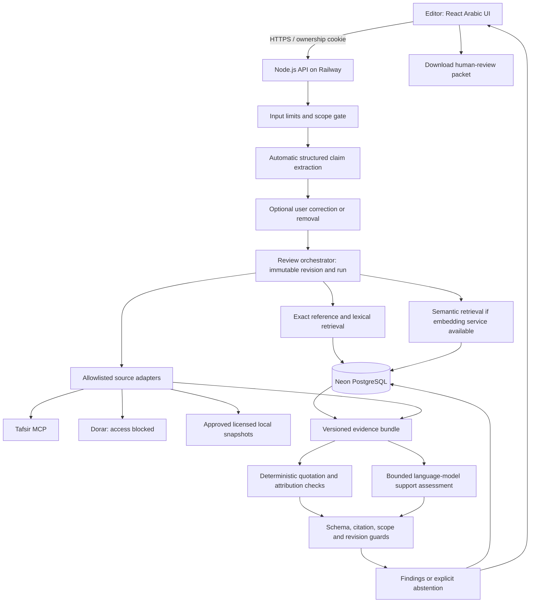
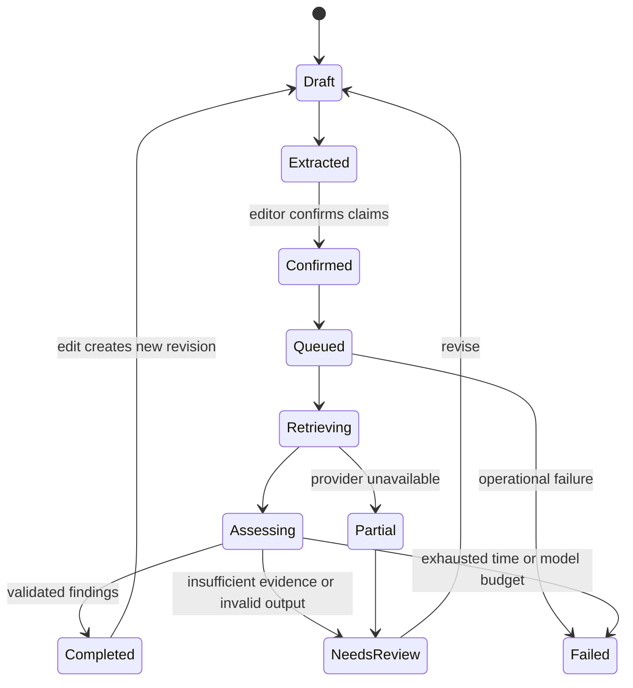

# System architecture

**Status:** target architecture. The current implementation contains an HTTP foundation, Arabic shell, review-run lifecycle and conservative deterministic quotation/attribution comparison; it does not yet execute the complete retrieval and support-assessment pipeline.

For the complete developer handoff—including system context, component and sequence diagrams, exact call timing, AI responsibilities, trust boundaries, failure paths, and implementation order—read the [system and AI orchestration blueprint](SYSTEM_BLUEPRINT.md).

## Design choice

Use a modular Node.js monolith on Railway, React/TypeScript on the same origin, and Neon PostgreSQL for persistent data. Avoid microservices and autonomous model-agent committees during the short hackathon. Different model tasks can share one provider; multiple calls are useful only where they add measurable value.

## Boundaries and responsibilities

| Module           | Responsibility                                           | Must not do                                         |
| ---------------- | -------------------------------------------------------- | --------------------------------------------------- |
| Intake           | Validate size, ownership and revision                    | Execute instructions inside a post                  |
| Extraction       | Propose structured claims with source offsets            | Declare claims true or add unsubmitted claims       |
| Retrieval        | Locate approved, attributed passages                     | Treat any web result as approved religious evidence |
| Source adapter   | Fetch, parse and normalize provider response             | Pass raw HTML directly to the browser               |
| Quote comparison | Exact/limited-normalized matching and attribution lookup | Independently grade hadith authenticity             |
| Support assessor | Compare a confirmed claim to supplied evidence           | Answer from unsupported model memory                |
| Evidence guard   | Resolve identifiers and enforce context/revision binding | Prove religious correctness from JSON validity      |
| Report           | Explain findings, limits and revision options            | Automatically approve or publish content            |

## Request lifecycle

Persist run state and an idempotency key before invoking paid services. A retry of the same confirmed revision must not accidentally create duplicate jobs. Store source and model versions with the run. On restart, recover only with a defined lease/attempt policy; otherwise mark interrupted work and offer a safe retry. Do not advertise resumable jobs before this exists.

For the first working slice, bounded processing in the Node service is acceptable. Do not keep an untracked background promise after returning a response. Add a durable worker/queue only if measured request duration and recovery needs require one. The database is authoritative; browser progress is not.

## Failure handling

Use the same source edition via a second delivery route or a licensed pinned snapshot whenever possible. Alternative works are different evidence, not invisible substitutes. Rebuild the evidence bundle, display the change and reassess. If no suitable evidence remains, abstain. Model-provider fallback must pass the same contract and evaluation gates; switching models is not a correctness guarantee.

No API/model output alone approves a finding. Schema validation catches malformed structure; citation resolution catches nonexistent references; source/context validation and human evaluation address substantive errors.

See [RAG](RAG.md), [data model](DATA_MODEL.md), [providers](../api/PROVIDERS.md) and [security](../../SECURITY.md).
