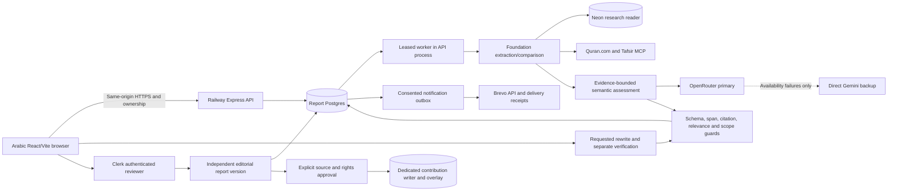

# Implemented system architecture

**Checkpoint:** 6 October 2026, application release `51654b2e045a03b33b0809cadf6a316864512a04`, semantic prompt/pipeline 1.14. [Live receipts](https://github.com/smaq777/Basira-Hackathon/issues/169#issuecomment-6022396451) establish selected behavior, not universal correctness. The older [system blueprint](SYSTEM_BLUEPRINT.md) is a design reference; current source/run evidence takes precedence.

## Deployment and trust boundaries

The browser never receives provider keys or database credentials. Submitted drafts and retrieved passages are untrusted data, not tool instructions. Models cannot authorize sources or approve their own interpretation.

## Actual call order

1. **Intake:** validate bounded Arabic text (3000 characters), owner and revision. Preserve exact submitted text; normalization is separate. Persist an idempotent run, input hash, corpus version and deadline before paid calls.
2. **Lease:** worker claims the run, heartbeats ownership and honors deadline/abort. A crash cannot be treated as completed analysis; recovery follows the store lease contract.
3. **Extraction:** identify Quran/hadith quotations, attribution/isnad (transmission chain), author text and claims with exact input offsets. Structured model interpretation is bounded by deterministic span/comparison checks. The public journey no longer requires manual phrase classification.
4. **Retrieval:** explicit references and contiguous quotations first; enabled lexical/vector retrieval supplies additional candidates. Query vectors use `openai/text-embedding-3-small` / 1536 through OpenRouter. Reject incompatible vectors. Ambiguous excerpts do not justify inventing a verse number; a hadith candidate does not establish authenticity or grading.
5. **Live sources:** canonical Uthmani Quran through existing Quran.com v4; Tafsir MCP protocol/schema negotiation and attributed Moyassar/Saadi fetches. Valid footnotes retain actual text. Independently completed works survive another work's failure; no synthetic fallback passage substitutes for unavailable evidence.
6. **Evidence packet:** bind original source windows, attribution, references, hashes, corpus and revision. Establish relevance to the actual claim. Optional enrichment failure retains already validated first-pass evidence and an explicit warning.
7. **Assessment:** bounded models compare only supplied claim/evidence, distinguishing support, contradiction and insufficient context. Preserve negation, conditions, attribution, scope and modality. Source/citation/offset guards reject unsupported output.
8. **Persistence/reload:** validate and save the report against the unchanged leased revision. UI polls then reads the owned persisted report; reload does not silently regenerate it. A new analysis creates a new run.
9. **Rewrite:** explicit request for eligible supported author wording only. Generator receives protected quotations and evidence. A separate verifier checks meaning, scope, modality, condition/quotation preservation and unsupported additions. Rejected candidates are withheld; cancellation supplies no copyable candidate and leaves original text unchanged.
10. **References/copy:** deterministic numbered References include only evidence used by the validated candidate. Server, displayed and copied text must be identical, including provisional notices. Candidates last ten minutes and are not durable reports.

## Physical storage and authority

| Connection / store                      | Records and purpose                                                                                                                                                          | Boundary                                                                              |
| --------------------------------------- | ---------------------------------------------------------------------------------------------------------------------------------------------------------------------------- | ------------------------------------------------------------------------------------- |
| Report DB / `DATABASE_URL`              | `basirah.guest_session`, `document`, `document_revision`, `review_run`, `review_run_event`, `review_report`, `evidence_item`, `finding`, `finding_evidence`, `review_packet` | Ownership/RLS and narrow application functions; not the Neon corpus DB                |
| Worker / `REVIEW_WORKER_DATABASE_URL`   | Leased run processing and report persistence                                                                                                                                 | Dedicated worker capability, not owner credentials                                    |
| Neon / `FOUNDATION_CORPUS_DATABASE_URL` | `source_edition`, `passage`, `passage_embedding`, `corpus_snapshot`, passage relations                                                                                       | Verified TLS, source reader, frozen membership/dimensions                             |
| Optional research cache                 | `research_page_cache`, `research_page_passage`, passage embeddings/content views                                                                                             | Policy-filtered candidates, not automatic approved evidence                           |
| Human report/ticket store               | `review_ticket`, `review_ticket_response`, `review_ticket_editorial`, events, `reviewed_source_receipt`                                                                      | Independent versions preserve automated original; user lookup remains ownership-bound |
| Writer / `REVIEWER_CORPUS_DATABASE_URL` | `reviewer_source_contribution` and source/passage records through restricted approval function                                                                               | Separate reader/writer roles and database binding guard; no general table writes      |
| Email                                   | `review_notification_outbox`, `review_email_delivery`                                                                                                                        | Consent/version binding; queued, accepted and delivered are distinct                  |

[Checked-in migrations](../../migrations) are authoritative. Report/worker/source-reader/writer credentials stay separate. Looking for reports in the corpus database is not a valid persistence diagnostic; an RLS-invisible row is not proof of deletion.

The frozen research snapshot has **175 passages / 175 compatible embeddings**, pin `7372242cf7f4960c2cba0a33d8670a04ce13413f9fab5536783d6a3671e3ad6f`. Approved additions use a separate `reviewed-<pin>` overlay, not a rewritten baseline. Transport availability, research inclusion, rights permission and qualified source approval remain different states. Previously approved evidence still needs relevance checks for a new claim.

## Prompt and fallback responsibilities

| AI task                  | Allowed work                                        | Acceptance guard                                        |
| ------------------------ | --------------------------------------------------- | ------------------------------------------------------- |
| Extraction               | Submitted text → structured roles/claims            | Input offsets, text and hashes resolve                  |
| Relevance                | Claim plus candidate passages → relevance proposal  | Existing source windows/IDs and bounded relevance       |
| Claim assessment         | Supplied evidence → provisional explanation         | Evidence binding, citations, scope and condition checks |
| Rewrite                  | Author wording/evidence → proposed improvement      | Unchanged quotation; no new comparison/source detail    |
| Independent verification | Original/candidate/evidence → preservation decision | Every required preservation check passes                |

Prompts/contracts are versioned in source, not a single unrestricted chatbot prompt. Direct Gemini backs up eligible primary availability failures only; it cannot override invalid output, relevance/meaning rejection or preservation failures, and does not replace embeddings. Owner spending limits require owner action, not silent removal or borrowed keys.

## Failure, privacy and reproducibility

- Upstream 401/403, timeout/quota/invalid output remain operational failures. Empty evidence does not make an outage a successful off-topic case.
- Legitimate insufficient context or unresolved attribution can have zero references. Abstain/referral rather than inventing Quran coordinates or a hadith source.
- Readiness verifies report DB/migration, not all providers. `verification:false` is deliberate provisional status.
- Guest retention is configured to 24 hours after last successful save. Reads do not renew expiry; missing/expired sessions are not resurrected.
- Separate ticket encryption/lookup keys; notifications require consent. Provider delivery events do not prove the recipient read email.
- Record accepted/deployed SHA, corpus/prompt versions, actual model/provider, input/evidence hashes and first outcomes. Do not rerun semantic rejection to chase a pass.
- Selected software/live tests are not a statistically validated religious-domain benchmark. Qualified evaluation remains outstanding.

## Implementation anchors

| Concern                     | Source / runbook                                                                                                                                                                                                          |
| --------------------------- | ------------------------------------------------------------------------------------------------------------------------------------------------------------------------------------------------------------------------- |
| Runtime and guards          | [server.ts](../../apps/api/src/server.ts), [integration](FOUNDATION_INTEGRATION.md)                                                                                                                                       |
| Durable processing          | [review-worker.ts](../../apps/api/src/review-worker.ts), [database.ts](../../apps/api/src/database.ts)                                                                                                                    |
| Retrieval                   | [hosted-corpus.ts](../../apps/api/src/hosted-corpus.ts), [quran-api.ts](../../apps/api/src/quran-api.ts), [tafsir-mcp.ts](../../apps/api/src/tafsir-mcp.ts)                                                               |
| Embeddings                  | [query-embedding.ts](../../apps/api/src/query-embedding.ts)                                                                                                                                                               |
| Semantic prompts and packet | [semantic-assessment.ts](../../apps/api/src/semantic-assessment.ts), [semantic-assessment-packet.ts](../../apps/api/src/semantic-assessment-packet.ts), [semantic-relevance.ts](../../apps/api/src/semantic-relevance.ts) |
| Rewrite / verifier          | [rewrite.ts](../../apps/api/src/rewrite.ts), [substantive-rewrite.ts](../../apps/api/src/substantive-rewrite.ts), [rewrite-provider.ts](../../apps/api/src/rewrite-provider.ts)                                           |
| Backup                      | [gemini-backup.ts](../../apps/api/src/gemini-backup.ts), [activation](../operations/GEMINI_BACKUP.md)                                                                                                                     |
| Source approval             | [reviewer-corpus.ts](../../apps/api/src/reviewer-corpus.ts), [reviewer workflow](../operations/REVIEWER_STAGING_WORKFLOW.md)                                                                                              |
| Notifications               | [ticket-notifications.ts](../../apps/api/src/ticket-notifications.ts)                                                                                                                                                     |
| Online proof                | [corpus activation](../operations/SUBMISSION_CORPUS_ACTIVATION.md), [acceptance](../operations/SUBMISSION_ACCEPTANCE.md), [handoff](../hackathon/SUBMISSION_HANDOFF.md)                                                   |
