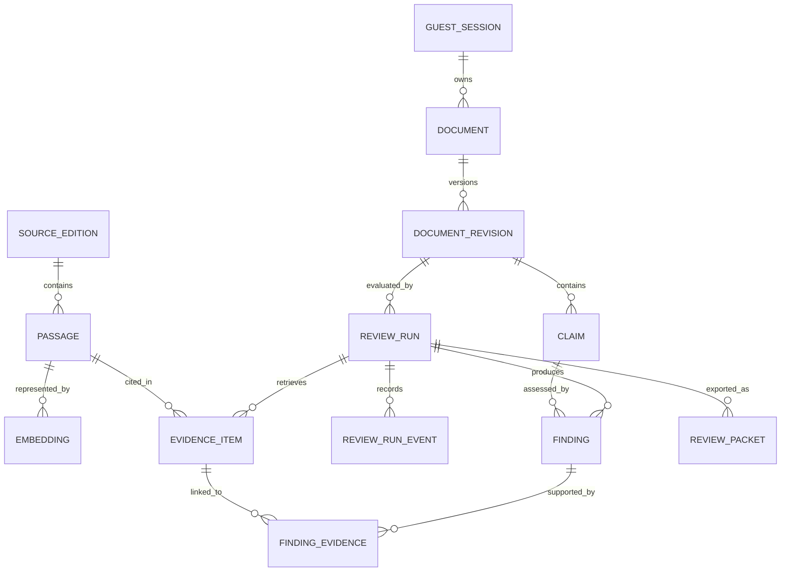
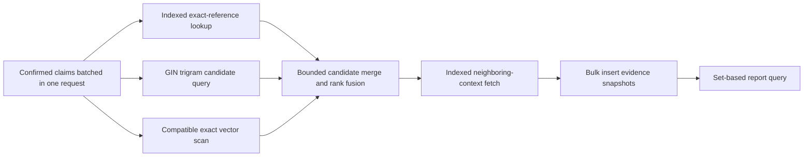

# Proposed PostgreSQL data model and retrieval indexes

**Not yet migrated or deployed.** PostgreSQL is planned; Drizzle migrations are a candidate implementation mechanism.

This document is the physical database handoff for [Issue #5](https://github.com/smaq777/Basira-Hackathon/issues/6), [Issue #6](https://github.com/smaq777/Basira-Hackathon/issues/7), [Issue #7](https://github.com/smaq777/Basira-Hackathon/issues/8), and the [complete system blueprint](SYSTEM_BLUEPRINT.md). Table and index names are proposed contracts, not evidence of a deployed Neon schema.



## Physical table catalog

Use `bigint generated always as identity` for internal joins and compact indexes. Give resources exposed in URLs an unpredictable `public_id uuid unique`; do not expose sequential IDs. All timestamps use `timestamptz`. Use `text` plus explicit checks instead of arbitrary `varchar` lengths.

| Table               | Required columns                                                                                                                                                                                        | Keys and constraints                                                                                                                                   | Main access path                                                   |
| ------------------- | ------------------------------------------------------------------------------------------------------------------------------------------------------------------------------------------------------- | ------------------------------------------------------------------------------------------------------------------------------------------------------ | ------------------------------------------------------------------ |
| `guest_session`     | `id`, `public_id`, `ownership_secret_hash`, `created_at`, `expires_at`, `deleted_at`                                                                                                                    | PK `id`; unique `public_id`; `expires_at > created_at`; never store the plaintext secret                                                               | Resolve ownership; delete or expire guest content                  |
| `document`          | `id`, `public_id`, `session_id`, `current_revision_id`, `created_at`                                                                                                                                    | PK; unique `public_id`; FK session; current revision must belong to the same document, enforced transactionally or with a deferred constraint strategy | Load an owned document and current revision                        |
| `document_revision` | `id`, `public_id`, `document_id`, `parent_revision_id`, `version`, `original_text`, `content_hash`, `created_at`                                                                                        | PK; unique `public_id`; unique `(document_id, version)`; immutable after insert; positive version                                                      | Load revision history; bind every claim/run to exact text          |
| `claim`             | `id`, `public_id`, `revision_id`, `ordinal`, `start_offset`, `end_offset`, `confirmed_text`, `claim_type`, `confirmed_at`                                                                               | PK; unique `public_id`; unique `(revision_id, ordinal)`; valid offset and bounded type checks                                                          | Read confirmed claims in document order                            |
| `source_edition`    | `id`, `public_id`, `source_key`, `work_name`, `author_name`, `edition`, `content_version`, `source_url`, `rights_record`, `approval_status`, `approved_at`, `revoked_at`                                | PK; unique `public_id`; unique `(source_key, content_version)`; approval/revocation consistency checks                                                 | Filter retrieval to approved, versioned sources                    |
| `passage`           | `id`, `public_id`, `source_edition_id`, `stable_reference`, `ordinal`, `parent_passage_id`, `original_text`, `search_key`, `content_hash`, `created_at`                                                 | PK; unique `public_id`; unique `(source_edition_id, stable_reference)`; original text immutable                                                        | Exact reference lookup, neighboring context, Arabic lexical search |
| `passage_embedding` | `id`, `passage_id`, `model_id`, `dimensions`, `task_type`, `corpus_version`, `embedding`, `created_at`                                                                                                  | PK; unique `(passage_id, model_id, task_type, corpus_version)`; dimension/model compatibility check                                                    | Semantic candidate retrieval inside one compatible vector space    |
| `review_run`        | `id`, `public_id`, `revision_id`, `idempotency_key`, `status`, `attempt`, `lease_until`, `deadline_at`, `corpus_version`, `support_model`, `prompt_version`, `created_at`, `started_at`, `completed_at` | PK; unique `public_id`; unique `(revision_id, idempotency_key)`; state/timestamp checks                                                                | Idempotent start, status polling, worker recovery, report history  |
| `review_run_event`  | `id`, `run_id`, `sequence`, `event_type`, `safe_metadata`, `occurred_at`                                                                                                                                | PK; unique `(run_id, sequence)`; JSONB contains operational metadata only, never raw post/model chain-of-thought                                       | Diagnose transitions and retries without sensitive logs            |
| `evidence_item`     | `id`, `public_id`, `run_id`, `passage_id`, `source_version`, `reference`, `original_text_snapshot`, `retrieval_modes`, `retrieved_at`, `delivery_mode`, `content_hash`, `rank`                          | PK; unique `public_id`; unique `(run_id, passage_id)`; bounded delivery/retrieval values                                                               | Freeze the run's evidence and assemble reports                     |
| `finding`           | `id`, `public_id`, `run_id`, `revision_id`, `claim_id`, `quote_status`, `support_status`, `explanation`, `suggested_edit`, `created_at`                                                                 | PK; unique `public_id`; unique `(run_id, claim_id)`; status checks; revision/claim/run consistency                                                     | Load one guarded finding per confirmed claim                       |
| `finding_evidence`  | `finding_id`, `evidence_item_id`                                                                                                                                                                        | Composite PK `(finding_id, evidence_item_id)`; both FKs cascade with their owning run                                                                  | Resolve every concrete finding to actual evidence                  |
| `review_packet`     | `id`, `public_id`, `run_id`, `export_version`, `storage_key`, `created_at`, `expires_at`                                                                                                                | PK; unique `public_id`; unique `(run_id, export_version)`; expiry after creation                                                                       | Generate/download versioned human-review exports                   |

`safe_metadata` is for bounded values such as provider category, attempt number, duration, token count, and error class. It is not a shortcut for relational ownership or evidence fields, and it must not contain raw user content or credentials.

## Required extensions

Verify availability on the selected isolated Neon database before the first migration.

```sql
create extension if not exists pg_trgm;
create extension if not exists vector;
-- Enable only if the selected Neon plan permits it and operational review needs it.
create extension if not exists pg_stat_statements;
```

Arabic lexical retrieval uses `pg_trgm` on the separate `search_key`. Preserve `original_text` exactly. A generated `tsvector` with the `simple` configuration is an evaluation option, not the default, because the MVP must first compare its Arabic recall with trigram retrieval.

## Index catalog

PostgreSQL creates B-tree indexes for primary-key and unique constraints. It does **not** automatically index the referencing side of foreign keys, so every frequently joined or cascaded FK below is covered explicitly. Composite indexes put equality columns first and range/sort columns last.

### Identity, ownership, lifecycle, and report indexes

```sql
-- Expiration worker: only live sessions, ordered for bounded batches.
create index guest_session_expiry_idx
  on guest_session (expires_at, id)
  where deleted_at is null;

create index document_session_created_idx
  on document (session_id, created_at desc, id desc)
  include (public_id, current_revision_id);

-- Covers the circular current-revision FK and prevents reuse across documents.
create unique index document_current_revision_uidx
  on document (current_revision_id)
  where current_revision_id is not null;

-- Also enforces one immutable version number per document.
create unique index document_revision_document_version_uidx
  on document_revision (document_id, version);

create index document_revision_parent_idx
  on document_revision (parent_revision_id)
  where parent_revision_id is not null;

-- Serves ordered claim loading and covers the revision FK.
create unique index claim_revision_ordinal_uidx
  on claim (revision_id, ordinal)
  include (public_id, start_offset, end_offset, claim_type, confirmed_at);

-- Idempotency guard: a retry cannot create a second logical run.
create unique index review_run_revision_idempotency_uidx
  on review_run (revision_id, idempotency_key);

-- Fast report-history query for a revision.
create index review_run_revision_created_idx
  on review_run (revision_id, created_at desc, id desc)
  include (public_id, status, completed_at);

-- Small active-work index for recovery; terminal runs never enter it.
create index review_run_active_lease_idx
  on review_run (status, lease_until, id)
  where status in ('queued', 'retrieving', 'checking', 'assessing', 'validating');

create unique index review_run_event_run_sequence_uidx
  on review_run_event (run_id, sequence);

create index evidence_item_run_rank_idx
  on evidence_item (run_id, rank, id)
  include (passage_id, public_id, delivery_mode);

create unique index evidence_item_run_passage_uidx
  on evidence_item (run_id, passage_id);

-- Reverse lookup and FK/cascade support.
create index evidence_item_passage_idx
  on evidence_item (passage_id, run_id);

create unique index finding_run_claim_uidx
  on finding (run_id, claim_id)
  include (public_id, quote_status, support_status);

-- Cover the non-leftmost FK columns for joins and cascades.
create index finding_claim_idx
  on finding (claim_id, run_id);

create index finding_revision_idx
  on finding (revision_id, run_id);

-- The composite PK starts with finding_id; add the reverse direction.
create index finding_evidence_evidence_idx
  on finding_evidence (evidence_item_id, finding_id);

create index review_packet_run_created_idx
  on review_packet (run_id, created_at desc, id desc)
  include (public_id, export_version, expires_at);

create index review_packet_expiry_idx
  on review_packet (expires_at, id);
```

Do not add a separate index when an existing primary, unique, or composite index already covers the same leftmost columns. Every index increases storage and write cost.

### Exact reference, context, and lexical retrieval indexes

```sql
-- Select only currently approved sources without scanning revoked/history rows.
create index source_edition_active_idx
  on source_edition (source_key, content_version, id)
  where approval_status = 'approved' and revoked_at is null;

-- Exact source/reference lookup; also covers the source-edition FK.
create unique index passage_source_reference_uidx
  on passage (source_edition_id, stable_reference)
  include (public_id, content_hash, ordinal);

-- Restore neighboring context in source order without OFFSET scans.
create index passage_source_ordinal_idx
  on passage (source_edition_id, ordinal, id)
  include (stable_reference, public_id);

create index passage_parent_idx
  on passage (parent_passage_id, ordinal)
  where parent_passage_id is not null;

-- Candidate generation for Arabic spelling/wording variation.
create index passage_search_key_trgm_idx
  on passage using gin (search_key gin_trgm_ops);
```

The lexical query must use the trigram operator as a selective candidate filter, then rank the bounded candidates:

```sql
select
  p.id,
  p.source_edition_id,
  p.stable_reference,
  p.original_text,
  similarity(p.search_key, $1) as lexical_score
from passage p
join source_edition s on s.id = p.source_edition_id
where s.approval_status = 'approved'
  and s.revoked_at is null
  and p.source_edition_id = any($2::bigint[])
  and p.search_key % $1
order by lexical_score desc, p.id
limit $3;
```

Avoid `like '%term%'`, unbounded result sets, and normalization functions applied inside the `where` clause; those patterns prevent the intended index path. Normalize once during ingestion and once before binding the query parameter.

### Semantic retrieval indexes

For the initial approved corpus of 30–50 passages, use an **exact vector scan** after filtering to one compatible `model_id`, `task_type`, `dimensions`, and `corpus_version`. At this scale an approximate-nearest-neighbor index adds build/write complexity without demonstrated benefit.

```sql
create unique index passage_embedding_space_uidx
  on passage_embedding (passage_id, model_id, task_type, corpus_version);

create index passage_embedding_compatible_space_idx
  on passage_embedding (model_id, task_type, corpus_version, passage_id)
  include (dimensions);

select
  pe.passage_id,
  pe.embedding <=> $1::vector as semantic_distance
from passage_embedding pe
where pe.model_id = $2
  and pe.task_type = $3
  and pe.corpus_version = $4
  and pe.dimensions = $5
order by pe.embedding <=> $1::vector
limit $6;
```

Only add an HNSW or IVFFlat index after a representative corpus and `EXPLAIN (ANALYZE, BUFFERS)` show exact search missing the agreed latency budget. If the corpus grows enough to require approximate search, benchmark recall as well as latency and keep incompatible model spaces separate. A dimension match alone does not make embeddings compatible.

## Query-to-index map

| Runtime query                       | Expected index path                                                                  | Notes                                                                 |
| ----------------------------------- | ------------------------------------------------------------------------------------ | --------------------------------------------------------------------- |
| Resolve guest session by public ID  | Unique `guest_session(public_id)`                                                    | Compare the presented ownership secret to the stored hash server-side |
| Delete/expire guest batches         | `guest_session_expiry_idx`                                                           | Use bounded keyset batches by `(expires_at, id)`                      |
| Load document list/current revision | `document_session_created_idx` plus revision PK                                      | No N+1 revision lookup; join or batch                                 |
| Load claims for a revision          | `claim_revision_ordinal_uidx`                                                        | Returns display order with an index-only opportunity                  |
| Exact passage reference             | `source_edition_active_idx` then `passage_source_reference_uidx`                     | Exact lookup always precedes semantic inference                       |
| Neighboring source context          | `passage_source_ordinal_idx`                                                         | Keyset/range by ordinal; never deep `offset`                          |
| Arabic lexical candidates           | `passage_search_key_trgm_idx`                                                        | Filter approved source IDs before bounded ranking                     |
| Semantic candidates                 | `passage_embedding_compatible_space_idx`, then exact vector ordering                 | No ANN index for the 30–50-passage MVP                                |
| Start/retry review                  | `review_run_revision_idempotency_uidx`                                               | Use insert-on-conflict/get-existing semantics                         |
| Recover active run                  | `review_run_active_lease_idx`                                                        | Small partial index avoids scanning completed history                 |
| Poll/load report                    | Unique run public ID, then `evidence_item_run_rank_idx` and `finding_run_claim_uidx` | Fetch findings/evidence in bounded set queries, not per-row queries   |
| Resolve citations                   | Finding-evidence PK plus `finding_evidence_evidence_idx`                             | Both join directions are indexed                                      |
| Expire packets                      | `review_packet_expiry_idx`                                                           | Bounded deletion batches                                              |

## Fast retrieval execution plan



Performance rules:

1. Batch all confirmed claims with `values`, arrays, or `unnest`; do not run one database round trip per claim.
2. Keep candidate limits at every retrieval stage and restore context only for selected candidates.
3. Use one pooled Neon runtime connection configuration. Do not connect once per HTTP request.
4. Use the pooled connection string for application traffic and the direct/unpooled connection only for migrations or operations that require it.
5. Keep transactions short. Never hold a row lock while waiting for Tafsir MCP, Dorar, an embedding provider, or a language model.
6. Use keyset pagination `(created_at, id)` or `(ordinal, id)` instead of `offset` for growing history/admin views.
7. Assemble report data with bounded joins or a small fixed number of set queries; reject N+1 evidence/finding fetches.
8. Cache only source-permitted, version-addressed reference data. User reports remain ownership-checked and `no-store` at the HTTP boundary.

## Performance verification before acceptance

No latency claim is valid until measured on the selected Neon region and a representative staged corpus. Issue #5 and Issue #7 should record the following evidence:

1. Seed a representative corpus and realistic run/history counts without using private user data.
2. Run `analyze` after the seed so planner statistics are current.
3. Capture `EXPLAIN (ANALYZE, BUFFERS)` for every query in the query-to-index map.
4. Record planning time, execution time, returned rows, rows removed by filter, buffer hits/reads, and chosen index.
5. A sequential scan on a 30–50-row table can be the correct fastest plan; do not disable sequential scans merely to make an index appear used.
6. Load-test the complete retrieval path separately from embedding/model latency and report median and p95 values.
7. Compare exact + lexical, vector-only, and fused retrieval for both Recall@5 and database latency. Faster retrieval that loses required evidence is not acceptable.
8. Inspect slow/frequent queries with `pg_stat_statements` if the Neon plan permits it; never log bound user text.
9. Remove redundant or unused indexes only after representative observation, not during the first migration.

Set provisional database and end-to-end latency budgets in Issue #7 after the first staging pilot. The team must report measured results rather than converting a target into a performance claim.

Use relational constraints for identity, ownership, lifecycle and evidence links. JSONB may store bounded provider metadata and model diagnostics, but it must not replace ownership constraints or allow arbitrary source claims. Do not add a broad JSONB GIN index unless a measured containment query requires it. Do not store hidden model chain-of-thought; retain concise user-facing justifications and evidence.

Transactions must prevent findings from one revision attaching to another. Idempotency keys are scoped to the session and confirmed revision. Query resource ownership on every access; UUID unpredictability alone is not authorization.

Planned retention: guest content expires after 24 hours, with explicit delete. Delete dependent claims, runs, exports and caches containing user content. Public reference corpus retention is separate. Backup expiration and third-party processing must be documented before claiming complete deletion.

For migrations, test on an isolated Neon branch/database. Prefer expand-and-contract changes; keep application compatibility during deploy. Create large future indexes concurrently where migration tooling and transaction rules permit it. Never auto-run destructive production migrations at server startup.
