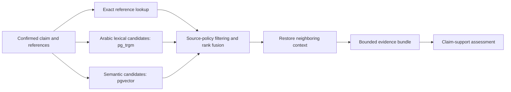

# Retrieval-augmented generation design

**Stage:** deterministic ranking and a persistent typed Neon development corpus
are implemented. Claim-driven retrieval and bounded web-discovery evaluation are
development integrations; approved production corpus and reviewer-labelled
accuracy evaluation remain pending. RAG supplies attributable evidence; it does
not train the model or guarantee correctness. See the [hosted corpus evidence](../evidence/2026-10-05-hosted-source-corpus.md).

**4 October decision:** the deployment target is hosted Neon PostgreSQL with
pgvector; local PostgreSQL/SQLite are development fixtures. See
[issue #8](https://github.com/smaq777/Basira-Hackathon/issues/8) and the
[integration/source dependency record](FOUNDATION_INTEGRATION.md).

## Corpus preparation

1. A content reviewer approves the work, edition, permitted use and intended claim coverage.
2. Record source URL, license/permission evidence, attribution, edition/version and retrieval date.
3. Preserve the original Arabic unchanged. Store a separate limited search-normalized representation.
4. Chunk by coherent verse explanation or passage, retaining qualifications and neighboring context. Do not cut away negation, exceptions or attributed disagreement.
5. Assign stable passage IDs and content hashes; retain reference coordinates and parent/neighbor links.
6. Embed only approved passages. Persist model ID, dimension, task type and corpus version.

The explicitly authorized development experiment can also embed pending sources
under `basirah_research_runtime`, with every evidence item marked research-only.
This permission never grants source approval or changes production visibility.
The typed corpus stores Quran/hadith originals, Tafsir commentary/footnotes,
`book_excerpt` and `scholar_explanation` independently. Cross-work explanation,
citation, context and footnote relations preserve attribution without implying
agreement. Immutable originals, context, provenance and source hashes are
separate from normalized search keys. `corpus_snapshot` records immutable
membership per corpus version so expanding a corpus reuses originals rather
than rewriting or duplicating them. Embeddings remain bound to their model,
dimensions, document task and corpus version.

## Retrieval cascade

Exact verse/report references take precedence for quotation checks. Lexical matching catches names and literal wording that vectors may miss. Semantic search proposes candidates; it must not override an exact source mismatch. Reciprocal-rank fusion is an initial implementation candidate; evaluate it against lexical-only and vector-only retrieval. Reranking is optional until measured benefit warrants latency and cost.

Use PostgreSQL `pg_trgm` for lexical similarity and `pgvector` for vectors. At 30–50 passages, exact vector scanning is sufficient; approximate indexes such as HNSW are unnecessary until the corpus grows. Verify Neon extension availability in the selected database before implementing migrations.

The implemented pure retrieval contract filters out every edition not marked `approved`, gives exact references priority, ranks Arabic lexical overlap, accepts optional precomputed semantic scores from a separately validated compatible embedding space, and fuses ranks deterministically. It preserves source originals and context identifiers and exposes Recall@k measurement. Current automated tests use synthetic passages; they do not establish real corpus recall or scholarly correctness.

## Model strategy

- **Development embedding space:** `openai/text-embedding-3-small`, 1,536 dimensions,
  with separately bound document/query tasks, original hashes and corpus version.
  Compatible hosted hybrid queries are verified; reviewer-labelled Arabic recall
  remains pending. Cohere Embed v4 was an earlier proposed candidate, not the
  current indexed space.
- **Extraction:** a low-cost structured-output model, selected through a small Arabic extraction benchmark.
- **Support assessment:** a stronger structured reasoning model evaluated on the bounded categories, not chosen solely by leaderboard claims.
- **No training from scratch.** Fine-tuning is out of the MVP scope. Authorized
  development provider calls use credentials only from the owning external
  `AI_Foundation/.env`; credentials and original corpora are not shipped here.

Embedding models are not interchangeable just because dimensions match. A fallback embedding provider requires a separately indexed compatible corpus. If embeddings fail, use lexical/reference retrieval and disclose degraded recall. Never compare vectors from incompatible model spaces.

## Evidence bundle

Supply a small structured bundle: confirmed claim, exact quoted span, source ID/work/edition, original passage, neighboring context, reference, retrieval mode and source delivery status. Constrain the model to these IDs. Validate its output against this bundle and the current revision. JSON is a transport contract, not a ground-truth certificate.

The current contract implements only a minimal provenance subset. The database and adapter implementations must add author/work/edition/rights metadata before real reports. Do not silently treat the current test fixture as the full source schema.

## Fallback policy

| Failure                                                 | Degraded path                                                                    | User-visible limitation                    |
| ------------------------------------------------------- | -------------------------------------------------------------------------------- | ------------------------------------------ |
| Live Tafsir MCP unavailable                             | Approved, version-matched local source snapshot, if licensed and prepared        | Snapshot version/date and offline delivery |
| Live source unavailable; only another work is available | Retrieve as a separately attributed source and reassess                          | Source changed; interpretation may differ  |
| Dorar denies access                                     | Approved limited references or human review; disable unsupported hadith features | No successful live Dorar verification      |
| Embedding service unavailable                           | Exact reference + lexical retrieval                                              | Semantic retrieval unavailable             |
| Reasoning provider unavailable                          | Deterministic quotation results only, if verified                                | Claim support not assessed                 |
| No approved evidence                                    | Explicit insufficient-evidence outcome                                           | Not a false-content verdict                |

## Evaluation

Measure reference-lookup accuracy, Recall@5 over reviewer-labeled relevant passages, citation resolution, per-category support performance and abstention. Freeze the corpus and hold out evaluation claims. Tune on development cases only. See [testing](../testing/STRATEGY.md).

Primary technical references: [Cohere embeddings](https://docs.cohere.com/v1/docs/embeddings), [pg_trgm](https://www.postgresql.org/docs/current/pgtrgm.html), [pgvector](https://github.com/pgvector/pgvector).
