# Basirah system and AI orchestration blueprint

**Purpose:** give a developer one implementation map for the complete Basirah system: what exists, what is planned, how parts connect, when each part is called, and which work must happen first.

**Runtime reconciliation:** 5 October 2026, development work in draft PR #59. The target design and historical merged-baseline table below remain planning references; they do not describe the current local integration build or imply production deployment.

## Current development records flow

1. Owned guest session → immutable document revision and hash → idempotent leased review run.
2. Local canonical index → quotation discovery/comparison; live Tafsir MCP supplies bounded related context.
3. Deterministic original author-span inventory → OpenRouter selection of at most five candidate IDs → per-claim exact/lexical/dense retrieval from the separate versioned Neon research corpus, plus eligible reusable research-cache originals when enabled → frozen originals → bounded exact source passage views → support assessment. Semantic v1.7 records unreviewed coverage; model selection and inference remain provisional. Views preserve original hashes/UTF16 offsets and neighboring sentences where bounded context permits; sentence-cut views alone cannot establish supported/contradicted. Full originals remain durable and their existing packet budget still applies.
4. If one claim lacks support/context and time remains, optional discovery uses the server JSON source policy, validates at most two extracted originals, and reassesses only that claim. Provider configuration selects Firecrawl or Tinyfish first with Firecrawl fallback. Eligible public originals can be machine-topic-classified and automatically persisted to the separate pending research cache for future initial retrieval. Supported findings do not trigger search. Failures preserve first-pass findings and a bounded trace.
5. Lease-bound completion persists the report, evidence originals/hashes and attribution. Semantic claims and provider/retrieval/discovery traces live in report JSON; the proposed normalized confirmed-claim tables below are not yet implemented.

The report database is local PostgreSQL in this development setup; the frozen reusable 62-passage corpus and separate public-page research cache are on an isolated Neon branch. New web snapshots persist with their report and, when cache is enabled, eligible originals are reused without changing the frozen corpus. Cache TTL, revocation, current-policy matching, original hashes, and separate reader/writer privileges apply. Private draft/query/review context is excluded from shared storage. Automatic storage and machine topics do not grant approval: website eligibility, digital-edition review, reuse rights, and scholarly approval remain separate states. See [cache evidence](../evidence/2026-10-05-reusable-research-page-cache.md), [dataset and records audit](../evidence/2026-10-05-islamiceval-records-audit.md), and [source policy](../../config/source-policy.json).

> This is a **target architecture**, not evidence that the target system is already working. The status labels below are part of the design. Passing software tests cannot establish religious correctness or scholarly approval.

## 1. Product in one sentence

Basirah helps an Arabic Islamic-content editor review a short draft by separating **quotation fidelity** from **claim support**, linking each finding to approved evidence, and abstaining or preparing a human-review packet when the available evidence is insufficient.

Basirah is not an unrestricted religious chatbot, a personal fatwa (فتوى شخصية) service, an independent hadith-grading authority, or an automatic publication-approval system.

## 2. Delivery truth and status legend

| Label           | Meaning in this repository                                                                    |
| --------------- | --------------------------------------------------------------------------------------------- |
| **Implemented** | Code exists on merged `main`.                                                                 |
| **Verified**    | The stated check was actually run and recorded; it does not imply broader product acceptance. |
| **Open issue**  | Work is specified in GitHub but has not been owner-accepted.                                  |
| **Planned**     | Target behavior documented here; no runtime success is claimed.                               |
| **Blocked**     | A named external, access, rights, or governance dependency prevents completion.               |
| **Later**       | Explicitly outside the hackathon MVP critical path.                                           |

### Historical merged baseline (1 October) versus target system

| Area                                 | Current merged state                                                                                                                                                | Target MVP owner                                                                                                                                                                                                              |
| ------------------------------------ | ------------------------------------------------------------------------------------------------------------------------------------------------------------------- | ----------------------------------------------------------------------------------------------------------------------------------------------------------------------------------------------------------------------------- |
| Web                                  | **Implemented:** honest Arabic foundation shell only                                                                                                                | [#14](https://github.com/smaq777/Basira-Hackathon/issues/15), [#15](https://github.com/smaq777/Basira-Hackathon/issues/16), and the scoped visual delivery issue [#25](https://github.com/smaq777/Basira-Hackathon/issues/25) |
| API                                  | **Implemented:** liveness, unavailable readiness, capabilities, and deliberate `501` review response                                                                | [#13](https://github.com/smaq777/Basira-Hackathon/issues/14)                                                                                                                                                                  |
| Contracts                            | **Implemented and unit-tested:** evidence/finding structure, revision/citation guards, bounded search key, provider failure classification, embedding compatibility | Extended across [#5](https://github.com/smaq777/Basira-Hackathon/issues/6)–[#13](https://github.com/smaq777/Basira-Hackathon/issues/14)                                                                                       |
| Database                             | **Planned; not migrated**                                                                                                                                           | [#5](https://github.com/smaq777/Basira-Hackathon/issues/6)                                                                                                                                                                    |
| Approved corpus                      | **Planned; rights and selection pending**                                                                                                                           | [#3](https://github.com/smaq777/Basira-Hackathon/issues/4), [#4](https://github.com/smaq777/Basira-Hackathon/issues/5)                                                                                                        |
| Retrieval / RAG                      | **Planned**                                                                                                                                                         | [#6](https://github.com/smaq777/Basira-Hackathon/issues/7), [#7](https://github.com/smaq777/Basira-Hackathon/issues/8)                                                                                                        |
| Tafsir MCP                           | **Planned; live contract not verified in Basirah**                                                                                                                  | [#8](https://github.com/smaq777/Basira-Hackathon/issues/9)                                                                                                                                                                    |
| Dorar                                | **Blocked:** sampled access returned `403`                                                                                                                          | [#9](https://github.com/smaq777/Basira-Hackathon/issues/10)                                                                                                                                                                   |
| AI extraction and support assessment | **Planned; provider/model not selected by benchmark**                                                                                                               | [#10](https://github.com/smaq777/Basira-Hackathon/issues/11), [#12](https://github.com/smaq777/Basira-Hackathon/issues/13)                                                                                                    |
| Scientific evaluation                | **Planned; no accuracy or impact result exists**                                                                                                                    | [#17](https://github.com/smaq777/Basira-Hackathon/issues/18)                                                                                                                                                                  |
| Deployment                           | **Templates only; no verified live Basirah product**                                                                                                                | [#19](https://github.com/smaq777/Basira-Hackathon/issues/20)                                                                                                                                                                  |

## 3. Non-negotiable system invariants

These rules apply across the UI, API, database, retrieval, and model layers.

1. Preserve the submitted Arabic text unchanged in an immutable revision. Search normalization is a separate derived value.
2. Submitting the draft starts automatic extraction and analysis without a mandatory classification dropdown. Preserve extracted spans for inspection and allow optional correction or removal before a new assessment.
3. Retrieve only approved source editions or explicitly disclose that evidence is unavailable.
4. An exact quotation can coexist with an unsupported conclusion. Never collapse quotation status and support status into one badge.
5. The model may assess only the confirmed claim and supplied evidence bundle. It must not answer from unsupported memory.
6. Every concrete finding must resolve to the current revision, a confirmed claim, and valid evidence identifiers.
7. Provider failure, missing evidence, and scholarly disagreement must lead to degraded output, abstention, or human review—not a false-content verdict.
8. A draft edit creates a new immutable revision and invalidates previous results as current results.
9. Browser state is not authoritative. Persist ownership, revision, run state, evidence, and findings server-side.
10. User and provider text are untrusted data, never instructions for tools, fetching, publishing, or privilege changes.
11. No model output, JSON schema success, or confidence score constitutes religious approval.
12. No automatic publication occurs anywhere in the MVP.

## 4. System context

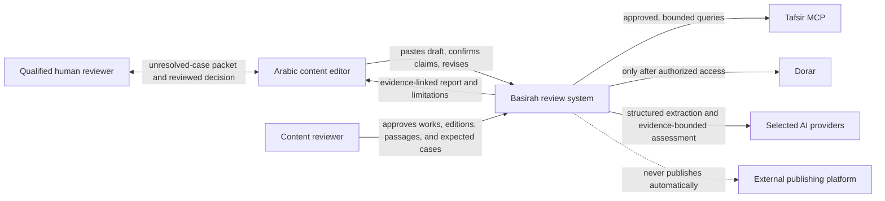

The editor is the publication decision-maker. The content reviewer approves sources and evaluation labels. The system can prepare a packet for a human reviewer, but it does not claim that a live reviewer is available.

## 5. Runtime containers and deployment topology

The MVP is a modular monolith, not a microservice fleet. This keeps the hackathon system explainable, testable, and deployable by a small team.

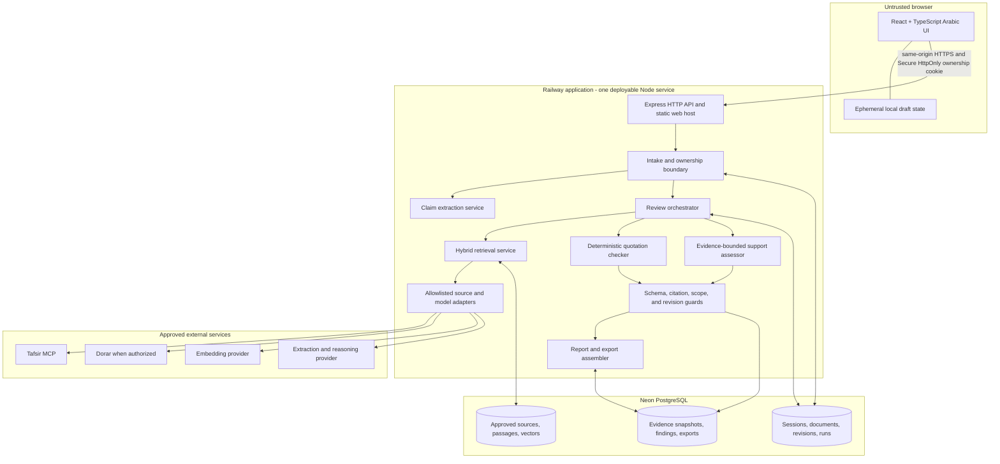

### Why one Node service first

- The request volume and corpus are small and unmeasured.
- A single deployable reduces distributed failure modes during the challenge.
- Module boundaries remain explicit, so a worker can be extracted later if measurements justify it.
- Do not return an HTTP response while leaving an untracked background promise. For the first slice, finish within a bounded request or persist a durable run and poll it.

## 6. Internal component map

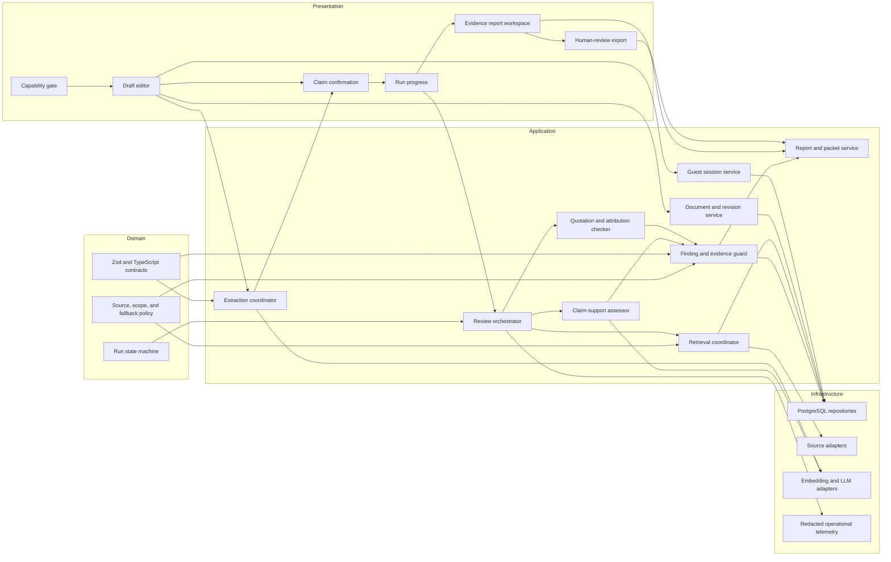

## 7. The AI design and hackathon novelty

The innovation is not “use one large model for everything.” It is an evidence-controlled workflow that assigns AI only to tasks where language understanding is useful and surrounds those calls with deterministic, provenance, and human controls.

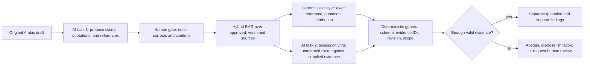

### What each intelligence layer contributes

| Layer                                     | Best tool                                                    | Why it exists                                                                                                                    | What it must never decide alone                                         |
| ----------------------------------------- | ------------------------------------------------------------ | -------------------------------------------------------------------------------------------------------------------------------- | ----------------------------------------------------------------------- |
| Draft parsing                             | Low-cost structured-output model, optionally helped by rules | Arabic claims and implied conclusions are difficult to capture with string rules alone                                           | Truth, authenticity, or publication approval                            |
| Exact references and quotation comparison | Deterministic code plus approved corpus                      | Reproducible comparison and clear source coordinates                                                                             | Broader support for an inference                                        |
| Candidate discovery                       | Exact lookup + Arabic lexical search + compatible embeddings | Recall across wording variation while retaining literal/reference matches                                                        | Which source is approved or whether a claim is true                     |
| Claim-support assessment                  | Stronger structured-output model                             | Compare a bounded claim with a bounded evidence bundle for overgeneralization, missing qualification, or unsupported exclusivity | Use model memory, create evidence, issue a fatwa, or judge a person     |
| Final guard                               | Deterministic contracts and source policy                    | Reject stale revisions, unknown claims, invented citations, and missing required evidence                                        | Establish scholarly correctness merely because JSON is valid            |
| Uncertain case                            | Human review                                                 | Handles insufficient evidence, source disagreement, or high-risk ambiguity                                                       | Be represented as a guaranteed live service before a partnership exists |

### Why this is materially different from generic RAG

1. The human confirms the claims before retrieval, preventing the system from silently reviewing a claim the user did not make.
2. Quotation fidelity and inferential support are modeled as separate outputs.
3. Source approval, source delivery, retrieval relevance, and model reasoning are independent gates.
4. Every finding is bound to an immutable revision and evidence identifiers.
5. Failure degrades capability visibly; it does not silently switch authority or invent completeness.
6. The system is designed to measure retrieval recall, citation validity, per-category support performance, abstention quality, editor time, latency, and cost.

## 8. Complete end-to-end sequence

```mermaid
sequenceDiagram
  autonumber
  actor E as Editor
  participant UI as React UI
  participant API as Express API
  participant DB as Neon PostgreSQL
  participant X as Extraction model
  participant R as Retrieval service
  participant S as Approved source adapters
  participant V as Vector and lexical store
  participant Q as Quotation checker
  participant M as Support model
  participant G as Evidence and revision guard

  E->>UI: Open application
  UI->>API: GET capabilities
  API-->>UI: Actual enabled features and provider state
  E->>UI: Paste Arabic draft
  UI->>UI: Client usability checks only
  UI->>API: Create guest-owned document revision
  API->>API: Validate size, scope, content type, and ownership
  API->>DB: Persist immutable revision and content hash
  API->>X: Extract structured claims with source offsets
  X-->>API: Candidate claims, quotations, and references
  API->>API: Validate extraction schema and offsets
  API-->>UI: Candidates; no verification verdict yet
  E->>UI: Edit, remove, and confirm claims
  UI->>API: Confirm claims for exact revision
  API->>DB: Persist confirmed claims and confirmation time

  E->>UI: Start review
  UI->>API: Create review with idempotency key
  API->>DB: Persist run before paid or external calls
  API->>R: Retrieve for confirmed claims under deadline
  par Local approved corpus
    R->>V: Exact reference and lexical candidates
    R->>V: Compatible semantic candidates when available
  and Approved live source routes
    R->>S: Allowlisted, source-scoped requests
  end
  V-->>R: Versioned candidate passages
  S-->>R: Validated passages or typed failure
  R->>R: Source-policy filter, rank fusion, restore context
  R->>DB: Persist immutable evidence bundle

  par Deterministic path
    R->>Q: Confirmed quote/reference plus evidence
    Q-->>API: Exact, normalized, mismatch, not applicable, or unresolved
  and Model path
    R->>M: Confirmed claim plus bounded evidence IDs and text
    M-->>API: Structured support assessment
  end

  API->>G: Validate claim, revision, citations, source scope, and required evidence
  alt Valid and sufficiently supported output
    G->>DB: Persist findings linked to run and evidence
    API-->>UI: Completed evidence-linked report
  else Missing evidence, invalid model output, or disagreement
    G->>DB: Persist partial or needs-review outcome and reason
    API-->>UI: Limitation, abstention, safe retry, or review-packet option
  end

  E->>UI: Apply suggested edit
  UI->>API: Create new revision; never overwrite old revision
  API->>DB: Persist child revision and invalidate old result as current
  API-->>UI: Return to claim confirmation for the new revision
```

## 9. When to call each part

The names in this table are logical application operations. The implemented public API remains the small contract in [`OPENAPI.yaml`](../api/OPENAPI.yaml); [#13](https://github.com/smaq777/Basira-Hackathon/issues/14) must finalize any new HTTP routes before frontend integration.

| Order | Caller → callee                    | Call when                                                      | Required input                                                                 | Successful output                                                                      | Do not call / fallback                                                                           |
| ----: | ---------------------------------- | -------------------------------------------------------------- | ------------------------------------------------------------------------------ | -------------------------------------------------------------------------------------- | ------------------------------------------------------------------------------------------------ |
|     0 | UI → `GET /api/v1/capabilities`    | App start and after an explicit recovery retry                 | None; ordinary request context                                                 | Actual stage, enabled features, and live-provider availability                         | Do not infer capability from environment variables or mock UI                                    |
|     1 | UI → session/document service      | User submits a non-empty draft within the client hint limit    | Draft, locale, client-generated request ID                                     | Guest-owned document and immutable revision IDs                                        | Reject empty, oversized, unsupported, or unauthorized content before model calls                 |
|     2 | API → extraction service           | Revision persistence succeeds                                  | Exact revision text and ID; extraction schema/version                          | Candidate claims, quotation spans, references, offsets                                 | On timeout/invalid output, return extraction failure; do not invent claims                       |
|     3 | UI → confirmation service          | Editor has inspected candidates                                | Revision ID plus edited/removed/confirmed claim set                            | Confirmed claims bound to revision                                                     | Never start full review for unconfirmed or stale claims                                          |
|     4 | UI → review orchestrator           | User explicitly starts review after confirmation               | Revision ID, confirmed claim IDs, idempotency key                              | Existing or newly persisted run ID and initial state                                   | Same logical retry returns the same run; no duplicate paid call                                  |
|     5 | Orchestrator → retrieval service   | Run is persisted and enters `retrieving`                       | Confirmed claims/references, approved source scope, corpus version, deadline   | Versioned evidence bundle or typed insufficiency/failure                               | Never accept arbitrary URLs or unapproved editions                                               |
|    5a | Retrieval → exact lookup           | A claim contains a recognized source coordinate or quotation   | Approved source IDs, reference, exact/original span                            | Direct candidates with stable passage IDs                                              | A missing result is `not_found`, not proof of fabrication                                        |
|    5b | Retrieval → lexical search         | Exact lookup is incomplete or wording must be located          | Search-normalized key, source scope, limit                                     | Literal/name-sensitive candidates                                                      | Normalization is only a search aid, never an exact-match verdict                                 |
|    5c | Retrieval → semantic search        | Compatible embeddings exist and semantic capability is enabled | Query embedding metadata matching corpus model/dimension                       | Meaning-related candidates                                                             | If unavailable, continue exact + lexical and disclose degraded recall                            |
|    5d | Retrieval → source adapter         | Approved live source may fill the bounded need                 | Allowlisted operation, approved edition, deadline                              | Validated attributed passage or typed failure                                          | No user URL, raw HTML rendering, or invisible source substitution                                |
|     6 | Orchestrator → quotation checker   | Evidence bundle is frozen for the run                          | Confirmed quotation/reference and original source passage                      | Separate quote and attribution statuses                                                | Do not ask the reasoning model to replace deterministic matching                                 |
|     7 | Orchestrator → support assessor    | At least one relevant approved evidence item exists            | Confirmed claim, evidence IDs/text/context, fixed rubric, prompt/model version | Structured support category, evidence IDs, concise explanation                         | If no approved evidence or provider failure, abstain or return deterministic-only partial result |
|     8 | Orchestrator → finding guard       | Every deterministic/model candidate output                     | Current revision, confirmed claim IDs, evidence bundle, source policy          | Accepted finding or typed rejection                                                    | Reject stale revision, unknown claim, duplicate/unknown citation, unsupported concrete finding   |
|     9 | Guard → persistence/report service | A valid result or explicit partial/needs-review outcome exists | Run, evidence, findings, limitations, versions                                 | Atomic stored report state                                                             | Never assemble a “complete” report from invalid or missing stages                                |
|    10 | UI → report reader                 | Polling/event indicates a terminal or partial state            | Owned run ID                                                                   | Evidence-linked report with limitations                                                | Browser cache cannot overrule server run state                                                   |
|    11 | UI → revision service              | User applies or writes an edit                                 | Parent revision ID and new full text                                           | New immutable revision and new content hash                                            | Never mutate old revision or reuse old findings as current                                       |
|    12 | UI → export service                | User requests escalation or download                           | Owned run ID and export format/version                                         | Packet with original/revised text, claims, evidence, limitations, unresolved questions | Do not imply a reviewer received it; packet generation is not submission                         |
|    13 | UI → delete service                | User explicitly deletes or session retention expires           | Ownership proof and session/document scope                                     | Inaccessible guest content and deletion record                                         | Verify caches, exports, and dependent rows; do not claim third-party deletion without evidence   |

### Target API surface to finalize in Issue #13

These routes are a proposed handoff shape, not implemented endpoints. The backend owner must update `OPENAPI.yaml`, shared schemas, tests, and frontend fixtures together before the frontend calls them.

| Proposed operation                                | Purpose                                                         | Expected lifecycle rule                                                 |
| ------------------------------------------------- | --------------------------------------------------------------- | ----------------------------------------------------------------------- |
| `POST /api/v1/documents`                          | Create the guest-owned document and first immutable revision    | Validates and persists before extraction                                |
| `POST /api/v1/revisions/{revisionId}/extractions` | Generate candidate claims, quotations, references, and offsets  | Never returns verification findings                                     |
| `PUT /api/v1/revisions/{revisionId}/claims`       | Replace the candidate set with the editor-confirmed claim set   | Rejects stale or unauthorized revisions                                 |
| `POST /api/v1/reviews`                            | Start or reuse an idempotent review of a confirmed revision     | Persists the run before external calls                                  |
| `GET /api/v1/reviews/{reviewId}`                  | Read authoritative run progress or a terminal report projection | First MVP should poll with bounded backoff; streaming is optional later |
| `POST /api/v1/documents/{documentId}/revisions`   | Create a child revision from edited full text                   | Never overwrites the parent or reuses its findings as current           |
| `POST /api/v1/reviews/{reviewId}/exports`         | Generate a versioned human-review packet                        | Packet creation is not delivery or scholarly acceptance                 |
| `DELETE /api/v1/session`                          | Explicitly delete the owned guest session and dependent content | Must be idempotent and verify inaccessible state                        |

Return stable error codes for ownership, validation, stale revision, capability unavailable, rate limit, timeout, insufficient evidence, and invalid provider/model output. Do not make the UI parse human-readable messages to decide system state.

## 10. Detailed review orchestration

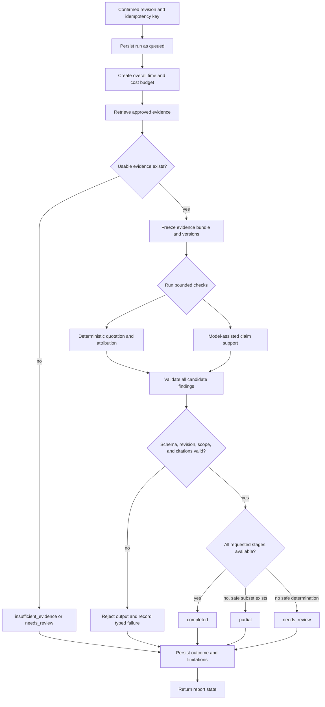

### Orchestrator pseudocode contract

```text
review(confirmedRevision, idempotencyKey):
  assert owned, current, immutable, and confirmed
  run = getOrCreateRun(confirmedRevision, idempotencyKey)
  if run is already terminal: return run

  persist run before external calls
  evidence = retrieveWithinApprovedScope(run.deadline)
  persist immutable evidence bundle and versions

  quoteResults = deterministicQuoteChecks(evidence)
  supportResults = evidence is sufficient
    ? boundedSupportAssessment(evidence)
    : explicitInsufficientEvidence

  validate every candidate against revision, claims, evidence, and source policy
  atomically persist accepted findings plus limitations and terminal state
  return only the stored report projection
```

The implementation may run synchronously for the first bounded slice. If measured latency exceeds a safe request duration, introduce a durable queue with leases and recovery; do not add a queue merely for architectural fashion.

## 11. Retrieval and evidence construction

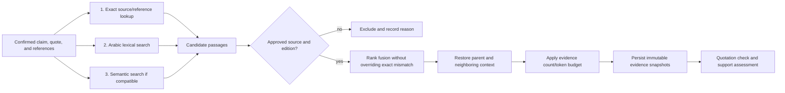

### Corpus preparation must precede semantic retrieval

1. Approve the work, edition, permitted use, attribution, and intended coverage.
2. Preserve the original Arabic exactly.
3. Create a separate, versioned search normalization.
4. Chunk by coherent meaning while retaining qualifications, exceptions, and neighboring context.
5. Assign stable passage IDs, references, parent/neighbor links, and content hashes.
6. Embed only approved passages; record model, dimension, task type, and corpus version.
7. Reject retrieval across incompatible embedding spaces even when vector dimensions happen to match.

At the proposed 30–50-passage size, exact vector scanning is sufficient. An approximate index is unnecessary until corpus size and measured latency justify it.

## 12. Failure, fallback, and abstention

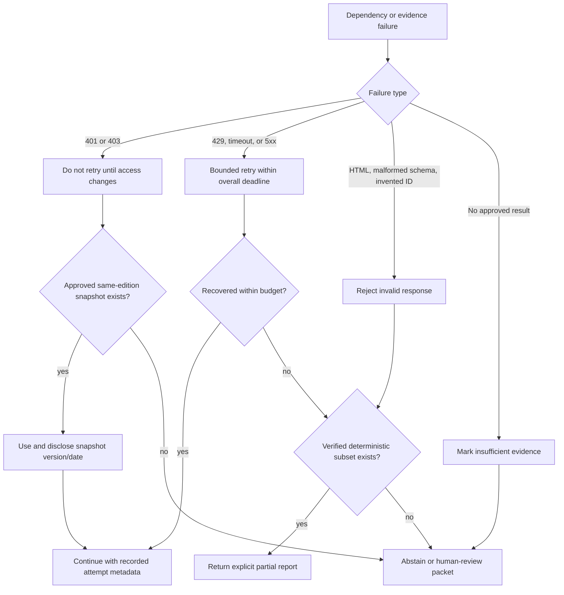

| Failure                           | Allowed behavior                                                             | Forbidden behavior                                             |
| --------------------------------- | ---------------------------------------------------------------------------- | -------------------------------------------------------------- |
| Live Tafsir MCP unavailable       | Use an approved, licensed, version-matched snapshot and disclose it          | Silently switch to a different work                            |
| Dorar unavailable or unauthorized | Disable unsupported hadith coverage or create a human-review outcome         | Treat an empty/blocked response as a fabricated-hadith verdict |
| Embedding provider unavailable    | Run exact/reference and lexical retrieval; disclose degraded semantic recall | Mix vectors from another model with the existing index         |
| Reasoning provider unavailable    | Return verified deterministic quotation results only, if meaningful          | Generate a support verdict without the assessment              |
| Model returns unknown citation    | Reject the finding                                                           | Display the citation because the JSON was well-formed          |
| Old revision result arrives       | Mark stale/reject                                                            | Attach it to the current draft                                 |
| No approved evidence              | `insufficient_evidence` or `needs_review`                                    | Infer falsity from absence                                     |
| Source disagreement               | Present bounded evidence and require review                                  | Hide disagreement behind one confidence percentage             |

## 13. Run and revision state machine

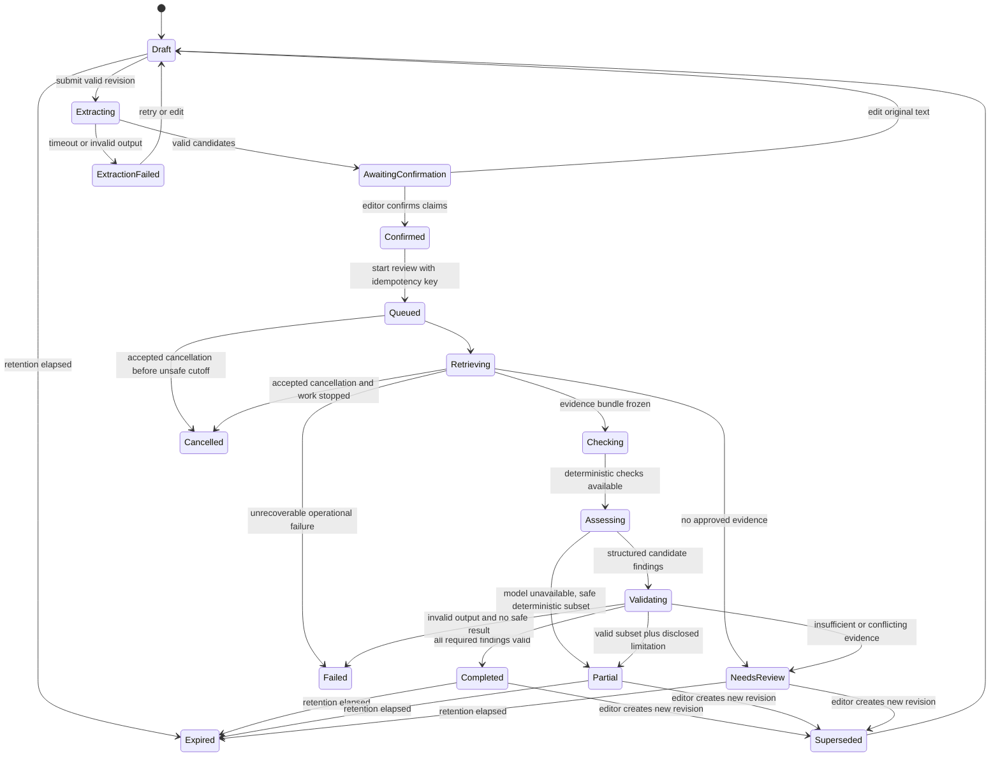

Only persisted state transitions are authoritative. A progress animation does not prove that retrieval, model assessment, or storage completed.

## 14. Data model and ownership

The diagram below shows entity relationships. The full proposed physical table catalog, SQL index definitions, query-to-index map, connection strategy, and `EXPLAIN` acceptance plan are in [`DATA_MODEL.md`](DATA_MODEL.md).

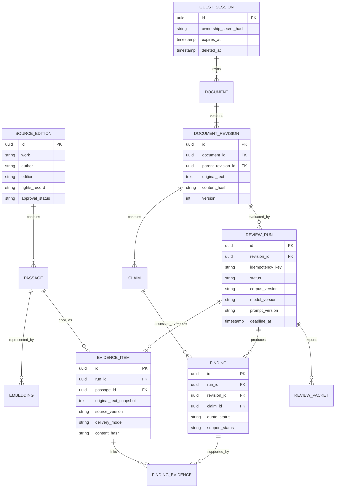

### Transaction boundaries

- Create a document revision and content hash atomically.
- Confirm claims only if they belong to the exact revision.
- Create or return a review run under a session-and-revision-scoped idempotency key.
- Freeze the evidence bundle before findings are accepted.
- Persist terminal run state and accepted findings atomically.
- Enforce resource ownership on every read, write, export, and delete; UUID unpredictability is not authorization.
- Delete or expire dependent guest content, exports, and caches according to the approved retention policy.

## 15. Trust boundaries and security flow

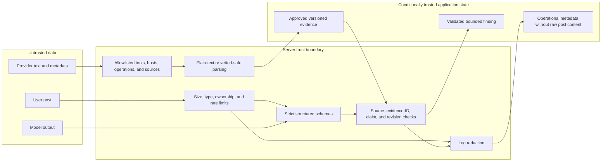

Required controls before real-user release include guest isolation, Secure and HttpOnly ownership cookies, CSRF/origin policy, SSRF prevention, safe rendering, no raw post logging, rate/cost budgets, explicit deletion, provider-processing disclosure, and negative tests for prompt injection, stale results, and cross-session access.

## 16. User-interface flow and invalidation rules

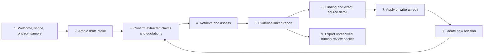

- Any change to the draft creates a new revision and makes the earlier report historical.
- Editing only the extracted claim before confirmation updates confirmation input; it does not change the original post silently.
- A “supported” label always means supported within the reviewed approved evidence, not universally certified true.
- Mobile navigation must preserve the selected claim while switching among text, findings, and sources.
- Use text labels and semantic status, never red/green alone.

## 17. Observability without sensitive content

Record enough metadata to reproduce and debug behavior without logging raw user posts or hidden model reasoning.

| Record     | Include                                                                                      | Exclude                                                              |
| ---------- | -------------------------------------------------------------------------------------------- | -------------------------------------------------------------------- |
| Request    | Request/run ID, route, timing, response category                                             | Ownership secret, raw post, cookies                                  |
| Retrieval  | Corpus/source version, retrieval modes, candidate counts, latency                            | Unlicensed bulk text, secret headers                                 |
| Model      | Provider/model, prompt/schema version, parameters, token/cost totals, latency, typed failure | API key, hidden chain-of-thought, full user content in ordinary logs |
| Finding    | IDs, statuses, guard rejection category                                                      | Unsupported free-form verdicts disconnected from evidence            |
| Deployment | Git revision, migration version, environment, readiness result                               | Credentials or raw environment dumps                                 |

The scientific evaluation dataset and reviewer decisions require their own controlled records. Operational telemetry is not the scientific result.

## 18. Implementation order and dependency plan

The system should be built in vertical slices, but dependencies still matter. The fastest safe route is to prepare governance, approved content, and data contracts first; then deliver one complete claim-to-evidence path before adding breadth.

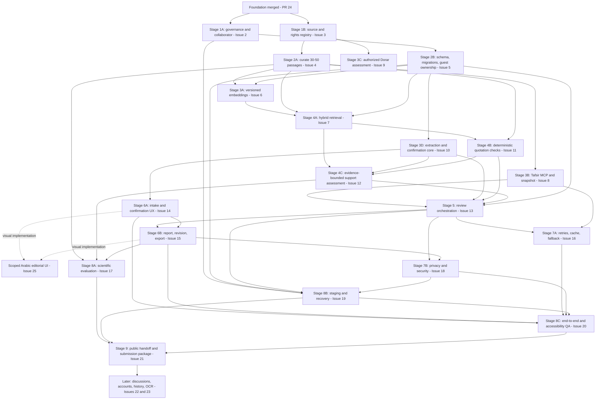

### Recommended execution sequence

| Stage                       | Finish condition before depending work proceeds                                                                      | Parallel work allowed                                                               |
| --------------------------- | -------------------------------------------------------------------------------------------------------------------- | ----------------------------------------------------------------------------------- |
| 0. Foundation               | Merged scaffold, contracts, checks, and honest unavailable endpoints                                                 | Complete                                                                            |
| 1. Governance and sources   | Enforceable workflow or recorded exception; works/editions/rights decision                                           | #2 and #3 can run in parallel                                                       |
| 2. Content and data         | Approved passages plus reviewed schema/migrations/session ownership                                                  | #4 and #5 can run in parallel after their own dependencies                          |
| 3. Integration primitives   | Embedding ingestion, source adapters, and claim extraction have real contract tests                                  | #6, #8, #9, and #10 are independent lanes after prerequisites                       |
| 4. Review intelligence      | Retrieval recall path, deterministic quote checks, and bounded support assessment work on one approved example       | #11 and extraction/UI contract work may overlap after #7                            |
| 5. Orchestration            | One idempotent persisted run reaches a valid or explicit abstention outcome                                          | This is the backend integration point; avoid parallel edits to shared run contracts |
| 6. Product journey          | Intake → confirmation → progress → report → new revision → export works without fabricated live results              | UI visuals can be built against versioned fixtures before live hookup               |
| 7. Reliability and security | Failure injection and negative security cases pass for the working slice                                             | #16 and #18 can proceed in parallel with agreed contracts                           |
| 8. Evidence and operations  | Held-out evaluation, staging/recovery, and complete accessibility/E2E evidence exist                                 | #17, #19, and some #20 preparation can overlap                                      |
| 9. Handoff                  | Owner-accepted revision, public/rights review, reproducible demo, presentation, video, and actual submission receipt | Do not begin public claims before evidence is accepted                              |

### First vertical slice

The first demonstrable slice should use **one approved source edition, a very small approved passage subset, one synthetic Arabic post, one confirmed claim, exact/lexical retrieval, deterministic quotation comparison, one evidence-bounded support assessment, one guarded finding, and one revision**. It should deliberately include the signature Basirah case: a quotation is accurate, but the conclusion requires qualification.

Only after this slice works and is testable should the team add broader source coverage, semantic retrieval, more categories, provider fallbacks, and presentation polish.

## 19. Two-developer handoff boundaries

| Shared contract         | Backend/data developer owns                                               | Frontend/product developer owns                            | Agree before parallel work                                  |
| ----------------------- | ------------------------------------------------------------------------- | ---------------------------------------------------------- | ----------------------------------------------------------- |
| Session and ownership   | Cookie/session lifecycle, authorization, expiry, deletion                 | Privacy disclosure, expired/deleted states                 | Cookie behavior, error codes, retention text                |
| Revision and extraction | Immutable revisions, extraction schema, offsets, confirmation persistence | Draft editor, span display, correction/confirmation UX     | Character-offset convention, max length, claim limits       |
| Review run              | Idempotency, state transitions, persistence, timeout/cancel semantics     | Start/retry/cancel behavior and progress announcements     | State enum, polling/event strategy, safe retry behavior     |
| Evidence and findings   | Source metadata, retrieval, guards, finding schema                        | Separate quotation/support display and evidence navigation | Status labels, evidence fields, partial-report contract     |
| Revision                | Parent-child revision creation and stale-result protection                | Suggested-edit preview, undo, recheck                      | Whether changes create draft immediately or only on confirm |
| Export                  | Server-generated packet and ownership/expiry                              | Download action and clear “not submitted” wording          | Format, version, included provenance and limitations        |

Rules for both developers:

- Change shared schemas first and version fixtures in the same PR.
- The frontend may use synthetic fixtures, but must label them as demo data and never imply live verification.
- Provider-specific response types stop at adapters; application services consume normalized domain contracts.
- Do not merge conflicting interpretations by choosing one side of a Git conflict wholesale.
- Record actual test evidence on the owning GitHub issue and PR. The owner performs acceptance and issue closure.

## 20. Verification gates

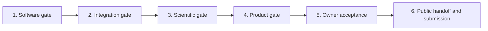

1. **Software:** types, unit/integration tests, HTTP contracts, docs, policy, formatting, build, dependency audit.
2. **Integration:** real permitted provider schema, failure behavior, database isolation, and reproducible source versions.
3. **Scientific:** reviewer-approved held-out cases, retrieval Recall@5, per-class results, citation validity, abstention quality, errors, and uncertainty.
4. **Product:** complete Arabic flow, RTL/mobile/keyboard/accessibility, privacy, deployment, restart, and rollback evidence.
5. **Acceptance:** owner reviews scope, evidence, limitations, and unresolved risks.
6. **Release:** public repository after history/secrets/rights review, exact live revision, presentation/video, and verified submission receipt.

Hard gates before release: no unresolved invented citations, no accepted stale-revision findings, no cross-session access, no outage reported as false content, and no unapproved source in the demo.

## 21. Source-of-truth map

| Question                                        | Source of truth                                                                                                                                 |
| ----------------------------------------------- | ----------------------------------------------------------------------------------------------------------------------------------------------- |
| What is delivered now?                          | [`STATUS.md`](../STATUS.md) plus merged code and CI evidence                                                                                    |
| What should the product do?                     | [`REQUIREMENTS.md`](../product/REQUIREMENTS.md)                                                                                                 |
| How should the full system connect and execute? | This blueprint                                                                                                                                  |
| How does retrieval work?                        | [`RAG.md`](RAG.md)                                                                                                                              |
| What is stored?                                 | [`DATA_MODEL.md`](DATA_MODEL.md)                                                                                                                |
| Which providers/sources are allowed or blocked? | [`PROVIDERS.md`](../api/PROVIDERS.md) and [`RIGHTS.md`](../governance/RIGHTS.md)                                                                |
| What does the current HTTP API actually expose? | [`OPENAPI.yaml`](../api/OPENAPI.yaml) and merged server code                                                                                    |
| How is correctness evaluated?                   | [`STRATEGY.md`](../testing/STRATEGY.md) and [`CASES.md`](../testing/CASES.md)                                                                   |
| What work is next and what blocks it?           | Live [GitHub Issues](https://github.com/smaq777/Basira-Hackathon/issues) and the [delivery board](https://github.com/users/smaq777/projects/14) |

If a diagram conflicts with merged code about current behavior, merged code and its verified tests win. If a static plan conflicts with a newly accepted GitHub issue, update both this blueprint and the relevant contract document in the implementation PR.
