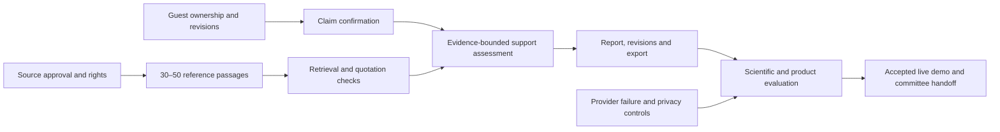

# Delivery backlog and dependencies

Operational board: [Basirah Delivery Board](https://github.com/users/smaq777/projects/13). Repository: [GitHub Issues](https://github.com/smaq777/Basira-Hackathon/issues). The board is private while development is private. Its access policy must be reviewed before committee handoff.

The [issue definitions](issues.json) document scope, acceptance, tests, risk and dependencies in English. Live issue/board status is authoritative; this table is a planning map, not a completion claim.

| Issue                                                        | Work item                                      | Milestone                             |
| ------------------------------------------------------------ | ---------------------------------------------- | ------------------------------------- |
| [#1](https://github.com/smaq777/Basira-Hackathon/issues/2)   | Documented, tested collaboration foundation    | M0                                    |
| [#2](https://github.com/smaq777/Basira-Hackathon/issues/3)   | Main/development protection and collaborator   | M0                                    |
| [#3](https://github.com/smaq777/Basira-Hackathon/issues/4)   | Source approval and rights registry            | M0                                    |
| [#4](https://github.com/smaq777/Basira-Hackathon/issues/5)   | Contextual reference corpus                    | M0                                    |
| [#5](https://github.com/smaq777/Basira-Hackathon/issues/6)   | Database schema and guest ownership            | M1                                    |
| [#6](https://github.com/smaq777/Basira-Hackathon/issues/7)   | Versioned embeddings                           | M1                                    |
| [#7](https://github.com/smaq777/Basira-Hackathon/issues/8)   | Hybrid retrieval                               | M1                                    |
| [#8](https://github.com/smaq777/Basira-Hackathon/issues/9)   | Tafsir MCP adapter and snapshot                | M1                                    |
| [#9](https://github.com/smaq777/Basira-Hackathon/issues/10)  | Authorized Dorar access                        | M1; non-blocking for Quran-only slice |
| [#10](https://github.com/smaq777/Basira-Hackathon/issues/11) | Claim extraction and confirmation              | M1                                    |
| [#11](https://github.com/smaq777/Basira-Hackathon/issues/12) | Quotation and attribution checks               | M1                                    |
| [#12](https://github.com/smaq777/Basira-Hackathon/issues/13) | Bounded support assessment                     | M1                                    |
| [#13](https://github.com/smaq777/Basira-Hackathon/issues/14) | Review orchestration                           | M1                                    |
| [#14](https://github.com/smaq777/Basira-Hackathon/issues/15) | Arabic intake interface                        | M1                                    |
| [#15](https://github.com/smaq777/Basira-Hackathon/issues/16) | Report, revision and export                    | M2                                    |
| [#16](https://github.com/smaq777/Basira-Hackathon/issues/17) | Reliability and failure handling               | M2                                    |
| [#17](https://github.com/smaq777/Basira-Hackathon/issues/18) | Scientific evaluation and baselines            | M2                                    |
| [#18](https://github.com/smaq777/Basira-Hackathon/issues/19) | Privacy and security controls                  | M2                                    |
| [#19](https://github.com/smaq777/Basira-Hackathon/issues/20) | Staging connections and deployment             | M2                                    |
| [#20](https://github.com/smaq777/Basira-Hackathon/issues/21) | End-to-end and accessibility QA                | M2                                    |
| [#21](https://github.com/smaq777/Basira-Hackathon/issues/22) | Public release and committee handoff           | M3                                    |
| [#22](https://github.com/smaq777/Basira-Hackathon/issues/23) | Evidence-bounded discussions                   | Later                                 |
| [#23](https://github.com/smaq777/Basira-Hackathon/issues/24) | Accounts, history and image intake             | Later                                 |
| [#25](https://github.com/smaq777/Basira-Hackathon/issues/25) | Scoped Arabic editorial website                | M1/M2 UI delivery                     |
| [#29](https://github.com/smaq777/Basira-Hackathon/issues/26) | Complete system and AI orchestration blueprint | M0 developer handoff                  |
| [#31](https://github.com/smaq777/Basira-Hackathon/issues/27) | Judge-ready governance and secure handoff      | M0                                    |

## Team allocation proposal

Saleh owns product scope, source-review coordination, acceptance and presentation. Developer A can own the backend/data/retrieval slice; Developer B can own Arabic UI/report/testing. Names and assignments remain unconfirmed; do not infer that either developer is a qualified scholarly reviewer. Coordinate shared contracts before parallel implementation.

## Scope control

Deliver a narrow working slice first. Dorar access is valuable but must not block a transparently scoped Quran/tafsir reference demonstration. Do not reduce safety/source approval to meet a deadline; reduce feature coverage instead. Accounts, OCR and open discussion remain outside the hackathon critical path.
