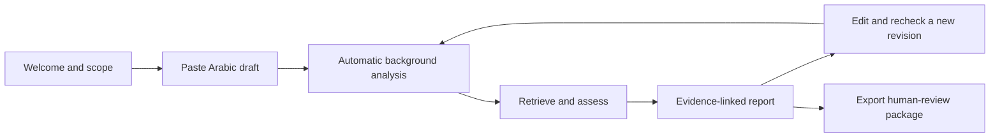

# User experience specification

**Status:** implemented as an illustrative prototype with database-backed guest intake and a Clerk-protected reviewer gate. Live verification, persistent reviewer workflows and approved-source integration remain pending. The MVP is a focused editorial workspace, not a ChatGPT clone. No mandatory public account is required.

## Screens and behavior

| Screen             | Main elements                                                                                                   | Primary action             | Required alternative state                                                                   |
| ------------------ | --------------------------------------------------------------------------------------------------------------- | -------------------------- | -------------------------------------------------------------------------------------------- |
| Welcome            | بصيرة, concise purpose, limits, privacy notice, sample synthetic post                                           | ابدأ المراجعة              | Explain demo/reference-set restrictions                                                      |
| Draft intake       | RTL editor, length counter, scope hint, retention disclosure                                                    | ابدأ المراجعة              | Empty, too short, clipboard failure                                                          |
| Automatic analysis | Background claim/quotation extraction, source matching and assessment                                           | Wait or cancel             | Visible progress, cancellation and later safe retry                                          |
| Processing         | Stages: retrieval, quotation comparison, support assessment                                                     | View progress              | Timed out, partial evidence, cancel, safe retry                                              |
| Review report      | Two quotation/support comparison cards; evidence panel; expandable corrected suggestion with safe copy feedback | Review or copy suggestion  | Empty/malformed suggestion; long text; denied clipboard; insufficient evidence; out of scope |
| Finding detail     | Exact source excerpt, author/work/reference, limitation, proposed edit                                          | Apply edit to new revision | Source unavailable or conflicting interpretations                                            |
| Export             | Original/revised text, evidence, unresolved questions, tool limitations                                         | Download review packet     | Expired session or missing evidence                                                          |

## Experimental pre-submit preflight

Issue #71 adds a local, reversible interaction trial before the full review starts. After a user
pastes or edits at least 20 characters, the editor separates semantic annotations from verification
findings. Semantic spans include Quran, hadith matn, isnad/attribution, user-claimed source,
attributed scholarly statement, interpretation, general claim and unknown. The background colour
describes what the span appears to be; an independent underline and textual status communicate a
provisional match, unresolved state or warning. Colour is never the only status signal.

A hadith-matn label does not establish authenticity or grading. An isnad/attribution label identifies
the apparent transmission or attribution wording without validating the chain. A claimed-source label
means only that the author wrote a citation; it is not an approved or matching source until the
separate comparison says so. A Quran or hadith cue is upgraded only when the small software fixture
retrieves a matching entry. The endpoint does not persist the draft and does not replace the immutable
submitted review.

The local fixture is for software and usability testing only. It is not the approved production
corpus, a provider integration or evidence of scholarly validation.

## Report layout

Desktop: draft on the right, finding list in the middle, evidence details on the left. Mobile: switch between text, findings and sources; retain claim selection. Use numbered findings and explicit labels, not red/green alone. A supported claim label means supported within the reviewed sources, not universally certified true.

Examples: **دقة الاقتباس: مطابق** and **دعم الاستنتاج: يحتاج إلى تقييد** may legitimately appear together. Avoid a misleading single overall confidence percentage. The model's self-reported confidence is not calibrated evidence.

Long submitted, source and suggested text must wrap without horizontal overflow. Collapse long suggestions only visually: retain the complete escaped text in the document, expose an accessible expand/collapse control and copy the full value. Provider and user strings are rendered as text, never as HTML. Clipboard denial must leave the visible suggestion selectable and announce a recoverable error.

The human-review package is a downloadable handoff, not an operational live-scholar service. No scholar identity, response time or availability is promised without an actual partnership.

## Accessibility and safety

Use the locally bundled Cairo family as the primary Arabic interface font, with system sans-serif fallbacks when the asset cannot load. Use logical CSS properties, RTL-aware navigation, accessible names, keyboard focus restoration, live progress announcements and a clear undo for suggested edits. English references and code fragments need isolated LTR rendering. Announce expired sessions before silently losing edits. A changed draft invalidates old results.

Existing concept images are design references only; the implemented foundation shell is deliberately marked incomplete. Visual approval does not establish scholarly approval or implementation completion.

The reviewer workspace uses a simple sidebar on desktop and a bottom navigation bar on mobile. Clerk authentication is verified again by the API before protected content is shown, while dashboard counts, queue records, decisions and source-registry entries remain labelled dummy data until reviewer persistence is implemented. Returning to the public interface keeps the current account session; the separate **تسجيل الخروج** action removes the protected interface and returns home immediately while Clerk completes session termination. The workspace includes loading, empty, recoverable error and saved-decision feedback without implying an operational scholar service.

## Later discussion feature

If added after the core flow is reliable, discussion is limited to explaining a selected finding using the same evidence bundle. A new claim requires a new review. The feature must not become unrestricted fatwa generation.
